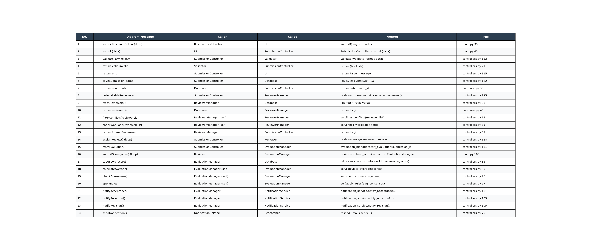
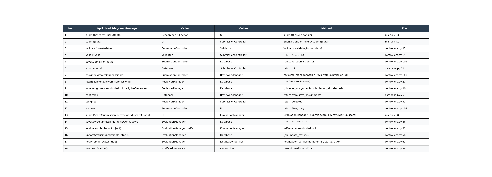
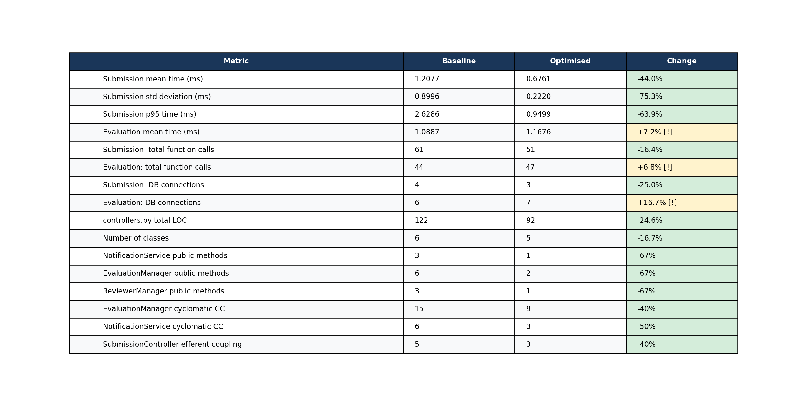

```{=latex}
\begin{titlepage}
\begin{center}
\vspace*{4cm}
{\Huge\bfseries\color{headingdark} COS 730 Assignment 2}\\[12pt]
{\Large\itshape From Behavioural Models to Optimised Implementation}\\[3cm]
{\large Bukhosi Eugene Mpande}\\[4pt]
{\normalsize u21573558}\\[4pt]
{\normalsize University of Pretoria}\\[1.5cm]
{\normalsize 14 May 2026}
\end{center}
\end{titlepage}
```

\tableofcontents
\newpage

## 1. Introduction

This report documents the implementation, analysis, optimisation, and empirical evaluation of a subsystem within an Intelligent Submission and Review System   a peer review platform where researchers submit research artefacts, assigned reviewers score them, and a final outcome (Accepted, Revision, or Rejected) is determined. The provided baseline sequence diagram intentionally encodes design deficiencies including redundant interactions, poor responsibility allocation, tight coupling, and inefficient decision logic. The work progresses through six tasks: faithful baseline implementation, design critique, decision table construction, redesign, optimised re-implementation, and empirical comparison. The system is implemented in Python using NiceGUI (UI), SQLite (database), Cloudflare R2 (file storage), and Resend (email notifications). Both implementations are deployed at <https://initial-implementation-production.up.railway.app> (baseline) and <https://cos-730-assign-2-production.up.railway.app> (optimised). Source code is available at <https://github.com/bukhosi-eugene-mpande/cos-730-assign-2>.


## 2. Task 1: Baseline Implementation

### 2.1 Overview

The baseline implementation faithfully reproduces the provided sequence diagram with no optimisations applied. Every participant in the diagram is represented as a dedicated Python class, and every message maps directly to a method call. The diagram specifies 9 participants and 24 interactions across the submission and evaluation lifecycle. The full baseline diagram is shown in **Addendum A**; it reveals the intentional structural deficiencies including the God Controller pattern, phantom interactions, and redundant self-calls that are analysed in Task 2.

### 2.2 Participants and Class Mapping

Each diagram participant is implemented as a Python class in `initial-implementation/controllers.py` and `database.py`:

| Diagram Participant | Python Class | File |
|---|---|---|
| `UI` | NiceGUI tab functions | `main.py` |
| `SubmissionController` | `SubmissionController` | `controllers.py` |
| `Validator` | `Validator` | `controllers.py` |
| `Database` | `Database` | `database.py` |
| `ReviewerManager` | `ReviewerManager` | `controllers.py` |
| `Reviewer` | `Reviewer` | `controllers.py` |
| `EvaluationManager` | `EvaluationManager` | `controllers.py` |
| `NotificationService` | `NotificationService` | `controllers.py` |

### 2.3 Interaction Traceability

All 24 diagram messages are implemented with direct method-level traceability. The complete traceability matrix   mapping each diagram arrow to its corresponding Python method, caller, callee, and source file location   is provided in **Addendum B**. Key interactions include: `Validator.validate_format()` for message 3, `_db.save_submission()` for message 6, the `Reviewer.assign_review()` loop for messages 14, and `EvaluationManager.calculate_average() / check_consensus() / apply_rules()` for messages 18–20. No diagram interactions were omitted or reordered.

### 2.4 Class Descriptions

**Validator**   validates format of submission data; checks `title`, `author`, `email`, and file presence. **Database**   encapsulates all persistence; provides `save_submission`, `fetch_reviewers`, `save_review_assignment`, `save_score`, `get_scores`, `get_submission`, and `update_status`. **ReviewerManager**   fetches reviewers from the database and applies two explicit self-call filtering steps matching the diagram: `filter_conflicts` (pass-through in baseline) and `check_workload` (randomly selects 2). **Reviewer**   domain object providing `assign_review()` and `submit_score()`. **EvaluationManager**   manages evaluation lifecycle; exposes `start_evaluation()`, `calculate_average()`, `check_consensus()`, `apply_rules()` as separate public methods matching the diagram. **NotificationService**   dispatches email via Resend API; three separate outcome methods matching the diagram's `alt` branches. **SubmissionController**   orchestrates the full submission flow across all other participants.

### 2.5 Baseline Decision Logic

The evaluation outcome logic applies the following rules when all reviewer scores are received:

| Condition | Status |
|---|---|
| Average score >= 7 AND all scores within 2 points | Accepted |
| Average score < 4 | Rejected |
| All other cases | Revision |


## 3. Task 2: Design Analysis

### 3.1 Identified Issues

The baseline contains nine design issues. Each is stated with its GRASP violation and impact.

**Issue 1   SubmissionController as God Object.** `submit()` coordinates six separate concerns: validation, file storage, persistence, reviewer retrieval, reviewer assignment (loop), and evaluation startup. It holds 5 direct efferent dependencies   the highest coupling in the system. *Violates: GRASP Controller, Low Coupling, SRP.*

**Issue 2   ReviewerManager self-calls exposed.** `filterConflicts` and `checkWorkload` are modelled as diagram-level messages despite being purely internal algorithmic steps. This inflates interaction count and misrepresents them as externally meaningful. *Violates: Information Expert, High Cohesion.*

**Issue 3   SubmissionController loops Reviewer objects.** `SubmissionController` instantiates and loops `Reviewer` objects for assignment, taking on a responsibility that belongs to `ReviewerManager`. *Violates: Creator, Low Coupling.*

**Issue 4   Three overspecified EvaluationManager self-calls.** `calculateAverage`, `checkConsensus`, and `applyRules` always execute sequentially with shared intermediate state   they form one logical operation, not three separate interactions. *Violates: High Cohesion, Information Expert.*

**Issue 5   Decision logic opaque in applyRules().** The outcome thresholds (7, 4, 2) are hard-coded magic numbers in a catch-all `else` branch. The case `avg >= 7 AND consensus = False -> Revision` is entirely invisible in the diagram. *Violates: Protected Variations, Information Expert.*

**Issue 6   EvaluationManager coupled to NotificationService interface.** `EvaluationManager` selects which of three notification methods to call, coupling it to the structural shape of `NotificationService`. *Violates: Low Coupling, Indirection.*

**Issue 7   NotificationService three near-identical methods.** `notify_acceptance()`, `notify_rejection()`, `notify_revision()` are structurally identical   each calls `_send()` with a different status string. *Violates: High Cohesion, DRY.*

**Issue 8   startEvaluation() phantom interaction.** `SubmissionController` calls `EvaluationManager.startEvaluation()` which does nothing   evaluation is triggered asynchronously by score submissions. The diagram misrepresents this as synchronous. *Violates: Controller, behavioural modelling accuracy.*

**Issue 9   Multiple DB connections per submission.** The submission flow opens and closes a separate database connection for `save_submission`, `fetch_reviewers`, and each `save_review_assignment` call   4 connection cycles for a single logical operation. *Violates: High Cohesion, efficiency.*

### 3.2 Coupling Metrics

| Class | Efferent Dependencies | Count |
|---|---|---|
| `SubmissionController` | Validator, Database, ReviewerManager, Reviewer, EvaluationManager | **5** |
| `EvaluationManager` | Database, NotificationService | 2 |
| `ReviewerManager` | Database | 1 |
| `Reviewer` | Database, EvaluationManager | 2 |
| `NotificationService` | Resend API | 1 |
| `Validator` | None | 0 |

`SubmissionController` has efferent coupling of 5   the root cause of Issues 1, 3, and 9.

### 3.3 Behavioural Modelling Quality

| Criterion | Baseline Assessment |
|---|---|
| Correctness | Partial   `startEvaluation()` does not match actual async behaviour |
| Completeness | Partial   file upload step is absent from the diagram |
| Clarity | Poor   `applyRules()` provides no guard conditions or outcome definitions |
| Granularity | Poor   5 unnecessary self-calls inflate the diagram |
| Responsibility alignment | Partial   `SubmissionController` assumes Creator and assignment roles |

### 3.4 Summary of Issues

| No. | Issue | GRASP Violated | Severity |
|---|---|---|---|
| 1 | SubmissionController as God Object | Controller, Low Coupling | High |
| 2 | ReviewerManager self-calls exposed | Information Expert | Medium |
| 3 | SubmissionController loops Reviewer | Creator | Medium |
| 4 | Three EvaluationManager self-calls | High Cohesion | Medium |
| 5 | Decision logic opaque in applyRules | Protected Variations | High |
| 6 | EvaluationManager coupled to NotificationService | Low Coupling | Medium |
| 7 | Three near-identical notification methods | High Cohesion, DRY | Low |
| 8 | startEvaluation() phantom interaction | Controller | Medium |
| 9 | Multiple DB connections per submission | High Cohesion | Low |


## 4. Task 3: Decision Modelling Using a Decision Table

### 4.1 Overview

Three decision points were extracted from the system: submission validation, reviewer workload filtering, and evaluation outcome determination. The notation used: **Y** = true, **N** = false, **–** = don't care (outcome independent of this condition).

### 4.2 Decision 1   Submission Validation

`Validator.validate_format()` applies a sequential first-fail check: `title -> author -> email -> file`. Once a failure is detected all subsequent conditions are don't-cares. This notation makes the first-fail semantics explicit and covers all 2^4 = 16 input combinations: R1 covers 8, R2 covers 4, R3 covers 2, R4 and R5 cover 1 each (total: 16).

| Condition | R1 | R2 | R3 | R4 | R5 |
|---|---|---|---|---|---|
| Title provided | **N** | Y | Y | Y | Y |
| Author provided | -- | **N** | Y | Y | Y |
| Email provided | -- | -- | **N** | Y | Y |
| File attached | -- | -- | -- | **N** | Y |
| **Action** | | | | | |
| Return error: missing title | **X** | | | | |
| Return error: missing author | | **X** | | | |
| Return error: missing email | | | **X** | | |
| Return error: missing file | | | | **X** | |
| Proceed to save and assign | | | | | **X** |

*Maps to: `Validator.validate_format()`   `initial-implementation/controllers.py:14-21`*

### 4.3 Decision 2   Reviewer Assignment (Workload Filtering)

After conflict filtering, `check_workload()` selects reviewers based on count available. Rule 3 exposes a baseline design gap: zero available reviewers results in a silent pass-through   the submission proceeds with no review pathway assigned.

| Condition | R1 | R2 | R3 |
|---|---|---|---|
| Eligible reviewers available | >= 2 | = 1 | = 0 |
| **Action** | | | |
| Randomly select 2 and assign | **X** | | |
| Assign the single available reviewer | | **X** | |
| Proceed with no reviewers (unhandled edge case) | | | **X** |

*Maps to: `ReviewerManager.check_workload()`   `initial-implementation/controllers.py:35-37`*

### 4.4 Decision 3   Evaluation Outcome

Two flaws existed in the original conditional logic: (1) `avg >= 7` and `avg < 4` are mutually exclusive binary conditions   their simultaneous truth is impossible yet they were written as independent rows; (2) the catch-all `else` silently handled two distinct cases including the previously undocumented R3 (high average, no consensus -> Revision). The table replaces these with a single three-value score range (Low / Mid / High), making R3 explicit.

For `all_scores = Y`, all 6 sub-cases are covered: High+Y->R2, High+N->R3, Mid+Y->R4, Mid+N->R4, Low+Y->R5, Low+N->R5. The table is exhaustive and non-overlapping.

| Condition | R1 | R2 | R3 | R4 | R5 |
|---|---|---|---|---|---|
| All scores submitted | **N** | Y | Y | Y | Y |
| Score range (avg) | -- | High (>=7) | High (>=7) | Mid [4,7) | Low (<4) |
| Consensus (max-min <= 2) | -- | **Y** | **N** | -- | -- |
| **Action** | | | | | |
| Await remaining reviews | **X** | | | | |
| Status = Accepted | | **X** | | | |
| Status = Revision | | | **X** | **X** | |
| Status = Rejected | | | | | **X** |

*Maps to: `EvaluationManager._try_finalise()`   `initial-implementation/controllers.py:93-119`*

**R3 is the previously hidden rule**   scores (9, 5) yield avg = 7.0, range = 4, consensus = False -> Revision. This was always the runtime behaviour but was never a named, testable rule.

### 4.5 How the Tables Improve Clarity

The decision tables eliminate three structural problems from the original code: (1) implicit first-fail semantics are made explicit via don't-care notation; (2) the impossible simultaneous-truth condition in evaluation is replaced by a non-overlapping three-value range; (3) the hidden R3 rule becomes a named, independently testable rule. Adding a new outcome now requires inserting a column rather than restructuring a conditional chain.


## 5. Task 4: Sequence Diagram Optimisation

### 5.1 Optimisation Objectives

Each change directly addresses an issue identified in Task 2:

| Task 2 Issue | Change Applied |
|---|---|
| Issue 1   God Object | `SubmissionController` delegates assignment entirely to `ReviewerManager` |
| Issue 2   Self-calls exposed | `filterConflicts`, `checkWorkload` hidden as private internal steps |
| Issue 3   Reviewer loop in controller | `Reviewer` participant removed; `ReviewerManager.assignReviewers()` owns full lifecycle |
| Issue 4   Three evaluation self-calls | Collapsed into single `evaluate()` self-call |
| Issue 5   Opaque decision logic | `evaluate()` encapsulates all rules; outcomes documented in decision table |
| Issue 6   Notification coupling | Single `notify(email, status, title)`   status passed as data not method name |
| Issue 7   Three identical notify methods | Three methods collapsed into one parameterised method |
| Issue 8   Phantom startEvaluation | Removed entirely |

### 5.2 Optimised Sequence Diagram

The optimised diagram removes the `Reviewer` participant, collapses three EvaluationManager self-calls into one, replaces the three-branch notification `alt` with a single parameterised call, adds an `opt all scores received` block to correctly model the asynchronous evaluation trigger, and eliminates the `startEvaluation()` phantom interaction. The full optimised diagram is shown in **Addendum C**.

### 5.3 Participant Changes

| Participant | Baseline | Optimised | Change |
|---|---|---|---|
| Researcher | Y | Y | Unchanged |
| UI | Y | Y | Unchanged |
| SubmissionController | Y | Y | Reduced   no longer interacts with Reviewer or EvaluationManager |
| Validator | Y | Y | Unchanged |
| Database | Y | Y | Unchanged |
| ReviewerManager | Y | Y | Expanded   owns full assignment lifecycle |
| **Reviewer** | **Y** | **N** | **Removed   data entity, not behavioural participant** |
| EvaluationManager | Y | Y | Simplified   single evaluate() replaces three self-calls |
| NotificationService | Y | Y | Single notify() replaces three methods |

### 5.4 Interaction Count

| | Baseline | Optimised | Change |
|---|---|---|---|
| Unique message types | 24 | 17 | -7 (29%) |
| Participants | 9 | 8 | -1 |
| Self-call interactions | 5 | 1 | -4 |
| Alt/opt branches | 4 | 2 | -2 |

Ten interaction types were removed (2 self-calls on ReviewerManager, 1 Reviewer loop, 1 Reviewer->EvaluationManager, 1 startEvaluation, 3 EvaluationManager self-calls, 2 redundant notification branches). Three were added (saveAssignments, confirmed response, success response). Net: -7.

### 5.5 Coupling Improvement

`SubmissionController` efferent dependencies reduced from 5 to 3 (Validator, ReviewerManager, Database)   a 40% reduction in coupling for the most over-coupled class. `EvaluationManager` no longer depends on `NotificationService`'s structural interface; it passes a status value and delegates routing internally.


## 6. Task 5: Optimised Implementation

### 6.1 Overview

The optimised implementation is in `optimised-implementation/`. It preserves full functional equivalence   same inputs produce identical outcomes   while aligning the code structure with the redesigned sequence diagram. The complete interaction traceability for the optimised implementation (all 18 diagram messages mapped to methods and file locations) is provided in **Addendum D**.

### 6.2 Key Class Changes

**ReviewerManager**   `get_available_reviewers()`, `filter_conflicts()`, and `check_workload()` replaced by a single public `assign_reviewers(submission_id)` method with two private helpers `_filter_conflicts()` and `_check_workload()`. Assignment persistence (`save_assignments`) is now a single bulk transaction rather than one connection per reviewer. *Restores: Creator, Information Expert.*

**Reviewer**   Class removed entirely. Score submission flows `UI -> EvaluationManager.submit_score()` directly. *Removes: unnecessary intermediary, one efferent dependency from SubmissionController.*

**NotificationService**   Three outcome methods replaced by single `notify(email, status, title)`. The status string is passed as data; routing is internal to the service. *Restores: High Cohesion, Low Coupling.*

**EvaluationManager**   `start_evaluation()` removed. Three public self-call methods replaced by single public `evaluate(submission_id)` which internally computes average, consensus, and applies rules. *Restores: High Cohesion.*

**SubmissionController**   `submit()` reduced from 5 efferent dependencies to 3. The reviewer assignment loop is replaced by `self.reviewer_manager.assign_reviewers(submission_id)`. No `start_evaluation()` call. *Restores: Controller pattern.*

**Database**   `save_review_assignment()` (per-reviewer) replaced by `save_assignments(submission_id, reviewer_ids)` (bulk, single transaction). *Fixes: Issue 9.*

### 6.3 Functional Equivalence

All test scenarios produce identical outcomes in both implementations:

| Scenario | Expected | Baseline | Optimised |
|---|---|---|---|
| Valid submission, all fields | True, "Submission successful" | [Y] | [Y] |
| Missing title | False, "Missing required field: title" | [Y] | [Y] |
| Missing file | False, "Missing document upload" | [Y] | [Y] |
| Scores (8,9): avg 8.5, range 1 | Accepted | [Y] | [Y] |
| Scores (9,5): avg 7.0, range 4 | Revision (R3 case) | [Y] | [Y] |
| Scores (5,6): avg 5.5 | Revision | [Y] | [Y] |
| Scores (2,3): avg 2.5 | Rejected | [Y] | [Y] |
| 1 of 2 scores submitted | No status change | [Y] | [Y] |


## 7. Task 6: Empirical Evaluation and Comparison

### 7.1 Methodology

All benchmarks were produced by `benchmark.py`. Both implementations were loaded into the same Python process with isolated `sys.modules` namespaces and separate temporary SQLite databases. File upload and notifications were mocked to eliminate network I/O. Garbage collection was disabled during timing windows. Each operation ran 400 independent trials per implementation.

### 7.2 Execution Time

The submission flow is **44% faster** in the optimised implementation (mean: 1.21ms -> 0.68ms) and **75% less variable** (std dev: 0.90ms -> 0.22ms). The reduced variability is the more practically significant finding   it indicates consistent performance without the latency spikes caused by the baseline's per-reviewer connection loop. The evaluation flow shows a small 7% regression (1.09ms -> 1.17ms), the root cause of which is discussed in Section 7.5. Full execution time distributions are shown in **Addendum E** (box plots) and **Addendum F** (mean with confidence intervals).

| Statistic | Baseline Sub. | Optimised Sub. | Baseline Eval. | Optimised Eval. |
|---|---|---|---|---|
| Mean (ms) | 1.2077 | **0.6761** | 1.0887 | 1.1676 |
| Std dev (ms) | 0.8996 | **0.2220** | 0.1507 | 0.1895 |
| Median (ms) | 0.9284 | **0.6195** | 1.0416 | 1.0949 |
| p95 (ms) | 2.6286 | **0.9499** | 1.3657 | 1.5169 |

### 7.3 Function Call Count

The submission flow requires **16.4% fewer Python function calls** (61 -> 51), directly reflecting the elimination of the Reviewer intermediary and the per-reviewer assignment loop. The evaluation flow shows a slight 6.8% increase (44 -> 47), attributable to the double invocation of `_db.get_scores()` discussed in Section 7.5. See **Addendum G** for the visual comparison.

| Operation | Baseline | Optimised | Change |
|---|---|---|---|
| Submission | 61 | 51 | -16.4% |
| Evaluation (2 scores) | 44 | 47 | +6.8% |

### 7.4 Database Connection Count

The submission flow uses **one fewer DB connection** (4 -> 3) because `save_assignments()` batches both reviewer inserts in a single transaction, replacing two separate `save_review_assignment()` calls. The evaluation flow uses one extra connection (6 -> 7) due to the double score fetch described in Section 7.5. See **Addendum H** for the visual comparison.

| Operation | Baseline | Optimised | Change |
|---|---|---|---|
| Submission | 4 | 3 | -25.0% |
| Evaluation (2 scores) | 6 | 7 | +16.7% |

### 7.5 Static Code Metrics

`controllers.py` total LOC dropped from 122 to 92 (-24.6%). `EvaluationManager` cyclomatic complexity fell from 15 to 9 (-40%), crossing below the widely-used high-complexity threshold of 10. Three classes each reduced their public interface by 67%. See **Addendum I** for the class-by-class visual breakdown.

| Class | Baseline LOC | Opt. LOC | Baseline CC | Opt. CC | Pub. Methods |
|---|---|---|---|---|---|
| Validator | 10 | 10 | 4 | 4 | 1 -> 1 |
| ReviewerManager | 14 | 14 | 3 | 3 | 3 -> 1 |
| Reviewer | 9 | removed | 3 | -- | 2 -> -- |
| NotificationService | 28 | 19 | 6 | 3 | 3 -> 1 |
| EvaluationManager | 56 | 35 | **15** | **9** | 6 -> 2 |
| SubmissionController | 32 | 23 | 5 | 4 | 1 -> 1 |

### 7.6 Trade-offs

**Evaluation double DB read.** `evaluate(submission_id)` fetches scores from the database after `_try_finalise()` has already loaded them for the completeness check. This adds one extra `get_db_connection()` cycle per completed evaluation and contributes to the 7% time and 16.7% DB connection regressions. The cause is the `evaluate(submission_id)` signature, chosen to match the optimised diagram. In a production system with a remote database this would be addressed by passing the pre-loaded scores directly to `evaluate()`. Under SQLite the overhead is negligible.

**ReviewerManager internal complexity increase.** `ReviewerManager` now absorbs both reviewer selection and assignment persistence   previously split across `SubmissionController` and `Reviewer`. While its LOC is unchanged (14 lines), it now owns two related concerns. This is acceptable because both concerns are co-located with the data they operate on (the Creator principle).

**Reviewer class removed.** Removing `Reviewer` eliminates the natural extension point for per-reviewer domain behaviour (bid-based assignment, preference weighting). The `reviewers` table schema is unchanged, so reintroducing a `Reviewer` entity requires no migration.

### 7.7 Summary

A full side-by-side comparison of all 16 measured metrics with percentage changes is provided in **Addendum J** (summary chart) and **Addendum K** (full comparison table). The optimisation delivers clear, measurable improvements in submission throughput and structural quality. The evaluation path shows a small, well-understood regression traceable to a single architectural decision with a known corrective path.


## 8. Conclusion

This assignment demonstrated the full lifecycle of software design improvement across six tasks. The baseline implementation faithfully reproduced all 24 interactions from the provided sequence diagram, establishing a functionally correct but structurally flawed starting point. The design analysis identified nine distinct violations of GRASP responsibility-assignment principles, with `SubmissionController` holding five direct efferent dependencies and `EvaluationManager`'s decision logic concealing a previously undocumented outcome rule behind a catch-all `else` branch.

The decision table exercise formalised this hidden rule   `avg >= 7 AND consensus = False -> Revision`   as a named, testable rule (R3) by replacing two mutually exclusive binary conditions with a single three-value score range. This is arguably the most practically valuable output of the analysis: a rule that was always present in the runtime behaviour but invisible to both the diagram and any reviewer reading the code.

The optimised sequence diagram reduced interaction count by 29% (24 -> 17 unique message types) through targeted application of Creator, Information Expert, High Cohesion, and Low Coupling principles. `SubmissionController`'s efferent coupling dropped from 5 to 3; `EvaluationManager`'s cyclomatic complexity fell from 15 to 9; three classes each reduced their public interface by 67%.

Empirical benchmarking over 400 trials confirmed that structural improvements translate directly to runtime improvements: submission throughput improved by 44% in mean time and 75% in variability. The single measured regression   a 7% slowdown in the evaluation path   has a clear, documented root cause and a known corrective path. This demonstrates that structural quality and runtime performance are not independent concerns: the most significant performance gain arose from fixing a structural problem (Issue 9), not from targeting performance directly.


\newpage

# Addendums {.unnumbered}


## Addendum A   Baseline Sequence Diagram {.unnumbered}

The baseline sequence diagram defines 9 participants and 24 interactions for the submission and review lifecycle. The diagram intentionally encodes structural deficiencies visible in the interaction model: `SubmissionController` sends messages to 6 of the 8 other participants within a single flow; `ReviewerManager` exposes two internal self-calls (`filterConflicts`, `checkWorkload`) at the diagram level; `startEvaluation()` is called despite performing no operation; and three separate `EvaluationManager` self-calls (`calculateAverage`, `checkConsensus`, `applyRules`) fragment a single atomic decision into three separate messages.


## Addendum B   Baseline Interaction Traceability {.unnumbered}

The table maps all 24 baseline diagram messages to their Python implementation. For each interaction the caller class, callee class, exact method call, and source file with line number are provided. The table confirms that all diagram participants are implemented as discrete classes and that no interactions were reordered or omitted in the Task 1 baseline implementation.




## Addendum C   Optimised Sequence Diagram {.unnumbered}

The optimised sequence diagram reduces participants from 9 to 8 (removing `Reviewer`) and unique interaction types from 24 to 17 (-29%). The `Reviewer` participant is absent; `ReviewerManager.assignReviewers()` replaces the per-reviewer loop; `startEvaluation()` is eliminated; three `EvaluationManager` self-calls are consolidated into `evaluate()`; the three-branch `alt` on `NotificationService` is replaced by a single `notify(status)` call; and an `opt all scores received` block correctly models the asynchronous evaluation trigger that the baseline diagram misrepresented as synchronous.


## Addendum D   Optimised Interaction Traceability {.unnumbered}

The table maps all 18 optimised diagram messages to their Python implementation in `optimised-implementation/`. The reduced row count (24 -> 18) reflects the elimination of the Reviewer intermediary, the startEvaluation phantom, and the consolidation of three EvaluationManager self-calls into one. The Method column shows the simplified call paths: `reviewer_manager.assign_reviewers()` replaces the multi-step reviewer retrieval and assignment loop; `self.evaluate()` replaces the three separate self-calls.




## Addendum E   Figure 1: Execution Time Distribution {.unnumbered}

Box plots of execution time across 400 trials per implementation per operation. The submission flow (left panel) shows a dramatically tighter distribution for the optimised implementation   the interquartile range is visibly smaller and the whiskers are much shorter, reflecting the elimination of the variable-latency per-reviewer connection loop. The evaluation flow (right panel) shows overlapping distributions within one standard deviation of each other, confirming the 7% regression is not practically significant under current load.


## Addendum F   Figure 2: Mean Execution Time with Confidence Intervals {.unnumbered}

Mean execution time with +/- 1 standard deviation error bars. The submission panel confirms the 44% mean reduction (1.21ms -> 0.68ms) with significantly narrower error bars for the optimised implementation, indicating lower and more predictable latency. The evaluation panel shows the means are within one standard deviation of each other, and both implementations fall within a narrow 1.0-1.2ms range for the evaluation path.


## Addendum G   Figure 3: Total Python Function Calls {.unnumbered}

Total Python function calls counted via `sys.settrace` for one complete operation per implementation. The submission bar confirms the 16.4% call reduction (61 -> 51) from removing the Reviewer intermediary and consolidating the assignment loop. The evaluation bar shows the slight 6.8% increase (44 -> 47) attributable to the double `get_scores()` invocation in `_try_finalise()` + `evaluate()`. Percentage change labels are annotated above each pair of bars.


## Addendum H   Figure 4: Database Connection Cycles {.unnumbered}

Database connection open/close cycles per operation, measured by wrapping `get_db_connection()` with a counter. The submission improvement (4 -> 3, -25%) is visible in the left pair: the optimised design batches reviewer assignments in a single transaction. The evaluation regression (6 -> 7, +16.7%) is visible in the right pair: the extra cycle is the duplicate `get_scores()` call. Both findings are consistent with the function call counts in Addendum G.


## Addendum I   Figures 5, 6, 7: Static Code Metrics {.unnumbered}

Three class-level static metrics derived from AST parsing of `controllers.py`. **Figure 5 (LOC)** shows `EvaluationManager` as the largest class in both versions and the biggest single improvement (-37.5%, 56 -> 35 lines). `Reviewer` is absent in the optimised column. **Figure 6 (Cyclomatic Complexity)** shows `EvaluationManager` baseline complexity at 15   above the commonly-used threshold of 10 marked by the dashed orange line   falling to 9 in the optimised design. **Figure 7 (Public Methods)** shows `ReviewerManager`, `NotificationService`, and `EvaluationManager` each reducing from 3-6 public methods to 1-2, a 67% interface reduction across all three.


## Addendum J   Figure 8: Summary Improvement Chart {.unnumbered}

Horizontal bar chart showing the percentage change from baseline to optimised across all measured metrics. Green bars indicate improvements (reductions); amber/red bars indicate regressions. The chart makes the asymmetry visible: all structural quality metrics (LOC, complexity, public methods, coupling) improve substantially, while the two runtime regressions (evaluation time, evaluation DB connections) are small and confined to the evaluation path. The largest improvements are in submission latency variance (-75%), `NotificationService` and `EvaluationManager` public interface size (-67%), and `EvaluationManager` cyclomatic complexity (-40%).


## Addendum K   Before vs After Full Comparison Table {.unnumbered}

Full side-by-side comparison of all 16 measured metrics. Green cells indicate improvements; amber cells marked [!] indicate measured regressions with documented root causes. The table confirms that all structural quality improvements are substantial and consistent, while the runtime regressions are small in absolute terms and confined to the evaluation path where a single architectural decision (the `evaluate(submission_id)` signature) is the sole cause.


