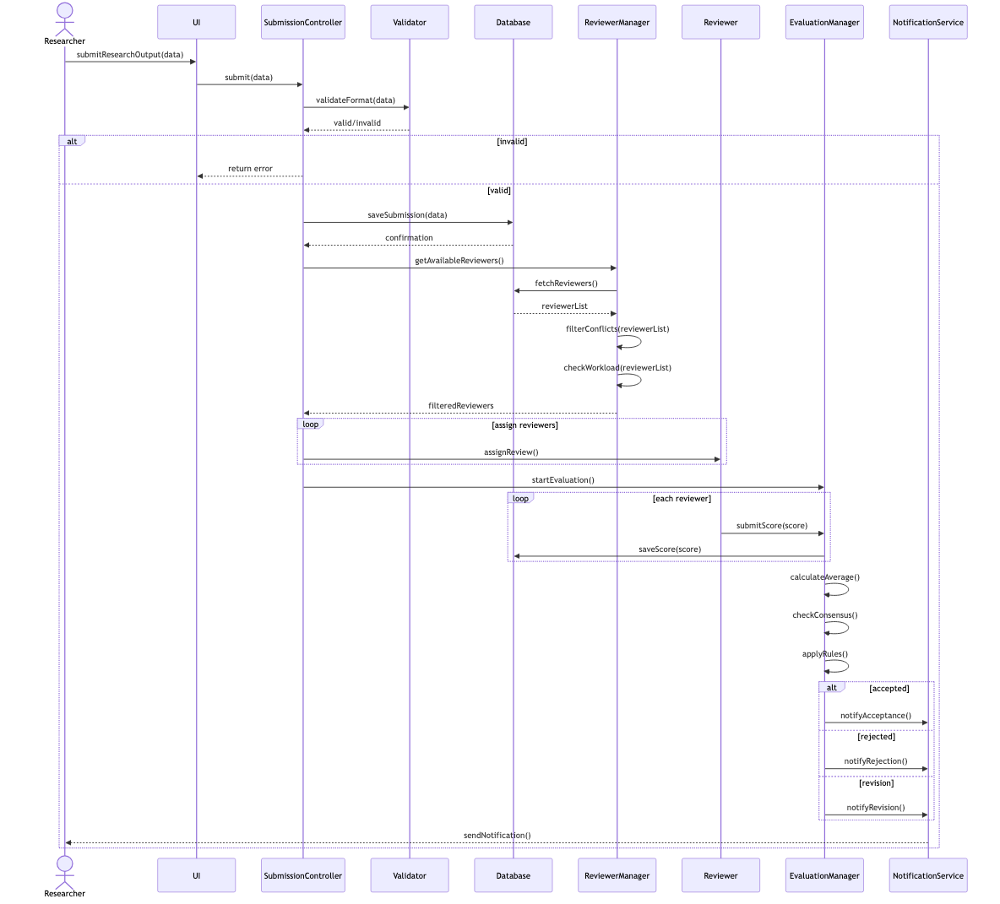
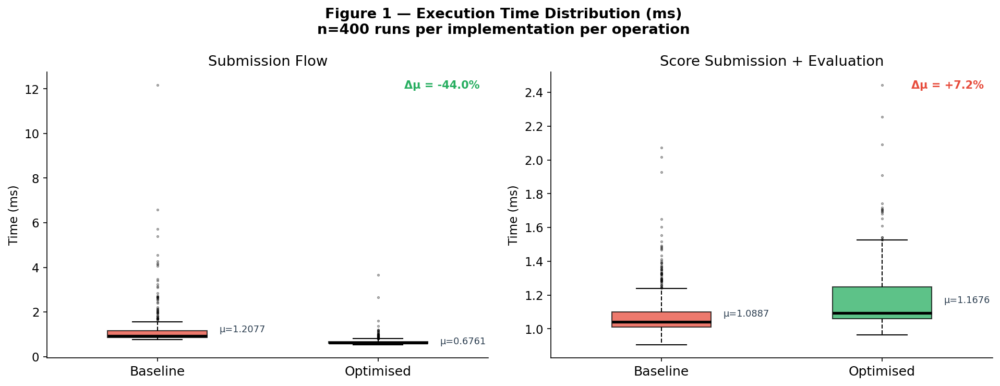
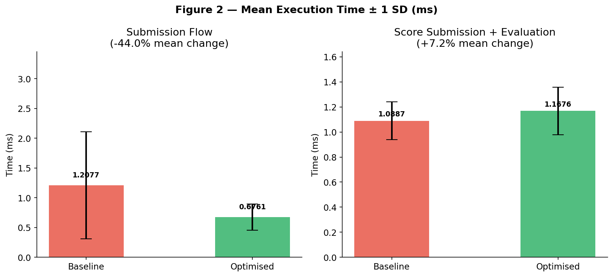
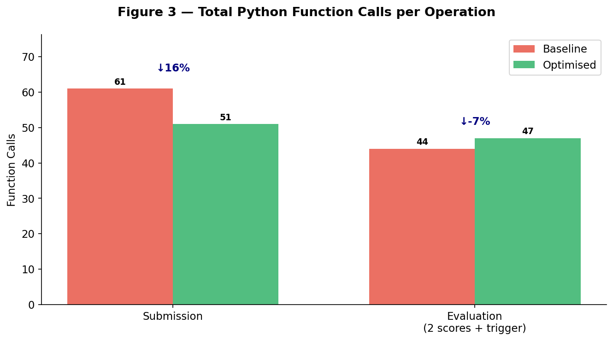
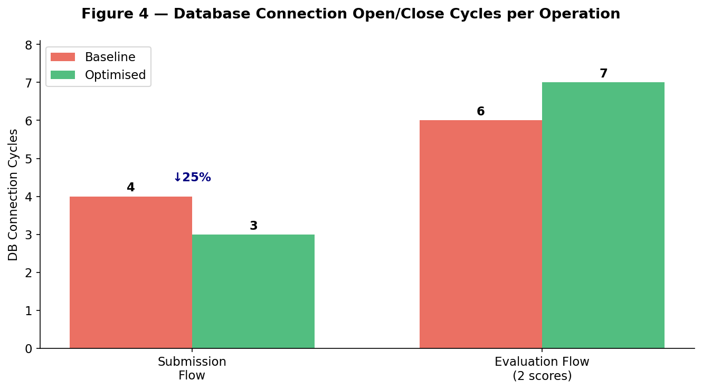
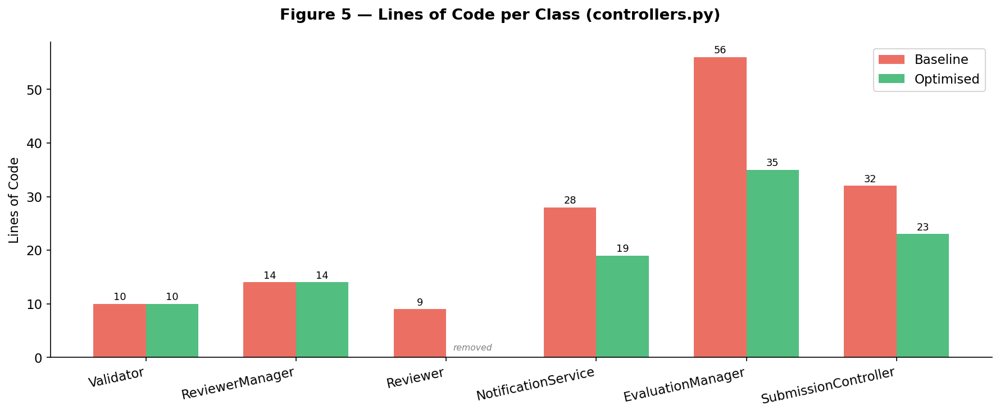
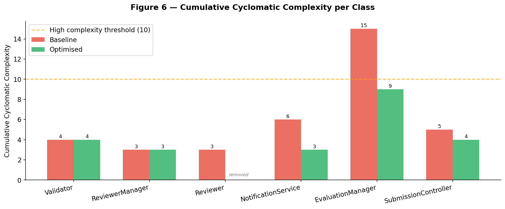
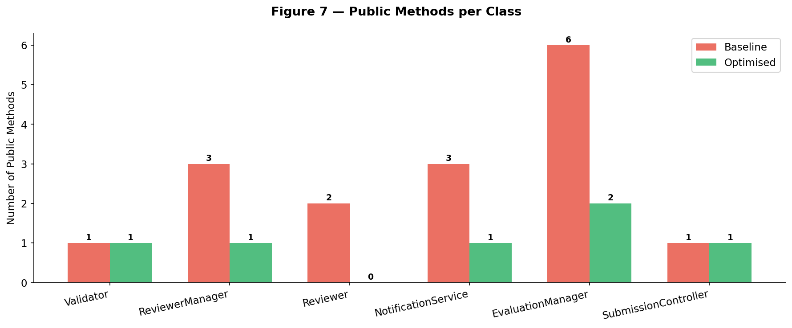
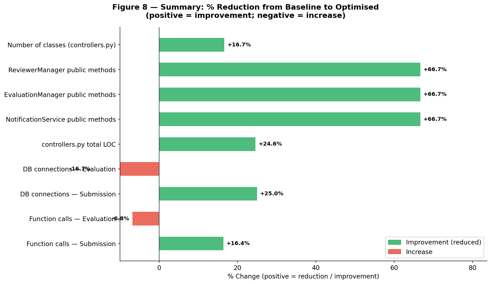

# COS 730 – Assignment 2
# From Behavioural Models to Optimised Implementation

**Name:** Bukohsi Eugene Mpande  
**Student Number:** u21573558


## Table of Contents

1. [Introduction](#1introduction)
2. [Task 1: Baseline Implementation](#2task1baselineimplementation)
3. [Task 2: Design Analysis](#3task2designanalysis)
4. [Task 3: Decision Modelling Using a Decision Table](#4task3decisionmodellingusingadecisiontable)
5. [Task 4: Sequence Diagram Optimisation](#5task4sequencediagramoptimisation)
6. [Task 5: Optimised Implementation](#6task5optimisedimplementation)
7. [Task 6: Empirical Evaluation and Comparison](#7task6empiricalevaluationandcomparison)
8. [Conclusion](#8conclusion)


## 1. Introduction

This report documents the design, analysis, optimisation, and empirical evaluation of a subsystem within an Intelligent Submission and Review System. The system models the lifecycle of a research artefact  from initial submission by a researcher through to peer evaluation and final outcome notification.

The provided baseline sequence diagram intentionally encodes a number of design deficiencies including redundant interactions, poor responsibility allocation, tight coupling, and inefficient decision logic. This assignment progresses through six tasks: faithful baseline implementation, design critique, decision table construction, redesign, optimised re-implementation, and empirical comparison.

The system is implemented in **Python** using:
 **NiceGUI**  reactive web UI framework
 **SQLite**  embedded relational database
 **Cloudflare R2**  cloud object storage for submitted documents
 **Resend**  transactional email delivery (via `resend` Python SDK)


## 2. Task 1: Baseline Implementation

### 2.1 Overview

The baseline implementation faithfully reproduces the provided sequence diagram with no optimisations applied. Every participant in the diagram is represented as a dedicated Python class, and every message (interaction) maps directly to a method call. The goal of this phase is correctness and traceability, not efficiency.

### 2.2 Participants and Class Mapping

The baseline sequence diagram (`baseline.mermaid`) defines the following participants:



Each participant maps to a dedicated Python class in the implementation:

| Sequence Diagram Participant | Python Class / Module | File |
|---|---|---|
| `UI` | NiceGUI tab functions (`researcher_tab`, `reviewer_tab`, `admin_tab`) | `main.py` |
| `SubmissionController` | `SubmissionController` | `controllers.py` |
| `Validator` | `Validator` | `controllers.py` |
| `Database` | `Database` | `database.py` |
| `ReviewerManager` | `ReviewerManager` | `controllers.py` |
| `Reviewer` | `Reviewer` | `controllers.py` |
| `EvaluationManager` | `EvaluationManager` | `controllers.py` |
| `NotificationService` | `NotificationService` | `controllers.py` |

### 2.3 Interaction Traceability

The table below maps every message in the baseline sequence diagram to its corresponding method in the codebase.


| No. | Diagram Message | Caller | Callee | Method | File |
|---|---|---|---|---|---|
| 1 | `submitResearchOutput(data)` | Researcher (UI action) | `UI` | `submit()` async handler | `main.py:35` |
| 2 | `submit(data)` | `UI` | `SubmissionController` | `SubmissionController().submit(data)` | `main.py:43` |
| 3 | `validateFormat(data)` | `SubmissionController` | `Validator` | `Validator.validate_format(data)` | `controllers.py:113` |
| 4 | `return valid/invalid` | `Validator` | `SubmissionController` | return value `(bool, str)` | `controllers.py:21` |
| 5 | `return error` | `SubmissionController` | `UI` | `return False, message` | `controllers.py:115` |
| 6 | `saveSubmission(data)` | `SubmissionController` | `Database` | `_db.save_submission(...)` | `controllers.py:122` |
| 7 | `return confirmation` | `Database` | `SubmissionController` | return `submission_id` | `database.py:35` |
| 8 | `getAvailableReviewers()` | `SubmissionController` | `ReviewerManager` | `reviewer_manager.get_available_reviewers()` | `controllers.py:125` |
| 9 | `fetchReviewers()` | `ReviewerManager` | `Database` | `_db.fetch_reviewers()` | `controllers.py:33` |
| 10 | `return reviewerList` | `Database` | `ReviewerManager` | return `list[int]` | `database.py:43` |
| 11 | `filterConflicts(reviewerList)` | `ReviewerManager` (self) | `ReviewerManager` | `self.filter_conflicts(reviewer_list)` | `controllers.py:34` |
| 12 | `checkWorkload(reviewerList)` | `ReviewerManager` (self) | `ReviewerManager` | `self.check_workload(filtered)` | `controllers.py:35` |
| 13 | `return filteredReviewers` | `ReviewerManager` | `SubmissionController` | return `list[int]` | `controllers.py:37` |
| 14 | `assignReview()` (loop) | `SubmissionController` | `Reviewer` | `reviewer.assign_review(submission_id)` | `controllers.py:128` |
| 15 | `startEvaluation()` | `SubmissionController` | `EvaluationManager` | `evaluation_manager.start_evaluation(submission_id)` | `controllers.py:131` |
| 16 | `submitScore(score)` (loop) | `Reviewer` | `EvaluationManager` | `reviewer.submit_score(sid, score, EvaluationManager())` | `main.py:108` |
| 17 | `saveScore(score)` | `EvaluationManager` | `Database` | `_db.save_score(submission_id, reviewer_id, score)` | `controllers.py:86` |
| 18 | `calculateAverage()` | `EvaluationManager` (self) | `EvaluationManager` | `self.calculate_average(scores)` | `controllers.py:95` |
| 19 | `checkConsensus()` | `EvaluationManager` (self) | `EvaluationManager` | `self.check_consensus(scores)` | `controllers.py:96` |
| 20 | `applyRules()` | `EvaluationManager` (self) | `EvaluationManager` | `self.apply_rules(avg, consensus)` | `controllers.py:97` |
| 21 | `notifyAcceptance()` | `EvaluationManager` | `NotificationService` | `notification_service.notify_acceptance(...)` | `controllers.py:101` |
| 22 | `notifyRejection()` | `EvaluationManager` | `NotificationService` | `notification_service.notify_rejection(...)` | `controllers.py:103` |
| 23 | `notifyRevision()` | `EvaluationManager` | `NotificationService` | `notification_service.notify_revision(...)` | `controllers.py:105` |
| 24 | `sendNotification()` | `NotificationService` | Researcher | `resend.Emails.send(...)` | `controllers.py:70` |


### 2.4 Class Descriptions

#### `Validator`
Responsible solely for validating the format of incoming submission data. Checks that all required fields (`title`, `author`, `email`) are present and that a file has been attached.

```python
class Validator:
    @staticmethod
    def validate_format(data):
        required_fields = ['title', 'author', 'email']
        for field in required_fields:
            if not data.get(field):
                return False, f"Missing required field: {field}"
        if not data.get('file_bytes'):
            return False, "Missing document upload"
        return True, "Valid"
```

#### `Database`
Encapsulates all persistence operations. Provides discrete methods for each diagram interaction: `save_submission`, `fetch_reviewers`, `save_review_assignment`, `save_score`, `get_scores`, `get_submission`, and `update_status`.

#### `ReviewerManager`
Retrieves available reviewers via the Database and applies two filtering steps as separate selfcalls matching the diagram: `filter_conflicts` (removes reviewers with conflicts of interest) and `check_workload` (limits assignment to 2 reviewers). In the baseline, conflict data is not yet maintained, so `filter_conflicts` is a passthrough.

#### `Reviewer`
Represents an individual reviewer. Provides:
 `assign_review(submission_id)`  persists the review assignment via the Database
 `submit_score(submission_id, score, evaluation_manager)`  delegates to `EvaluationManager.submit_score()`, matching the diagram's `Reviewer -> EvaluationManager` message

#### `EvaluationManager`
Manages the evaluation lifecycle. `start_evaluation()` is called by `SubmissionController` to open the evaluation phase. When all reviewers submit scores, `_try_finalise()` orchestrates the three selfcalls: `calculate_average()`, `check_consensus()`, and `apply_rules()`, then dispatches the appropriate notification.

#### `NotificationService`
Sends outcome notifications via the Resend API. Provides three separate methods  `notify_acceptance()`, `notify_rejection()`, `notify_revision()`  matching the three `alt` branches in the diagram.

#### `SubmissionController`
Orchestrates the full submission workflow: validate -> save -> assign -> start evaluation.

### 2.5 Decision Logic in the Baseline

The baseline applies the following rules when all scores are received:

| Condition | Status |
|---|---|
| Average ≥ 7 AND all scores within 2 points of each other | Accepted |
| Average < 4 | Rejected |
| All other cases | Revision |


## 3. Task 2: Design Analysis

### 3.1 Overview

The baseline sequence diagram, while functionally correct, contains a number of well-documented design anti-patterns. This section identifies each problem, provides evidence from both the diagram and the corresponding implementation, quantifies coupling and cohesion metrics, and explicitly relates every issue to the relevant GRASP responsibilityassignment principle and/or behavioural modelling quality criterion.

The nine GRASP patterns used as evaluation criteria throughout this section are: **Information Expert**, **Creator**, **Controller**, **Low Coupling**, **High Cohesion**, **Polymorphism**, **Pure Fabrication**, **Indirection**, and **Protected Variations**.


### 3.2 Identified Issues

#### Issue 1 : `SubmissionController` Violates the GRASP Controller Pattern (God Object)

**Problem:**
`SubmissionController.submit()` performs six distinct responsibilities in a single method: format validation, file storage, database persistence, reviewer retrieval, reviewer assignment iteration, and evaluation startup. A GRASP Controller should act as a **thin facade**  accepting system events and delegating work to domain objects. Here, `SubmissionController` micromanages every downstream operation rather than delegating.

**Evidence in diagram:**
`SubmissionController` sends messages to five other participants within one flow: `Validator`, `Database`, `ReviewerManager`, `Reviewer` (looped), and `EvaluationManager`. No other participant in the diagram sends messages to more than two others  the asymmetry alone flags a responsibility problem.

**Code evidence (`controllers.py:113–131`):**
```python
def submit(self, data):
    is_valid, message = self.validator.validate_format(data)   # delegates to Validator
    ...
    submission_id = _db.save_submission(...)                   # directly calls Database
    filtered_reviewers = self.reviewer_manager.get_available_reviewers()  # calls ReviewerManager
    for reviewer_id in filtered_reviewers:
        reviewer = Reviewer(reviewer_id)
        reviewer.assign_review(submission_id)                  # instantiates and calls Reviewer
    self.evaluation_manager.start_evaluation(submission_id)    # calls EvaluationManager
```

**GRASP principle violated:**
 **Controller**  the controller should delegate, not execute
 **Low Coupling**  `SubmissionController` holds direct runtime dependencies on 5 of the 7 other classes
 **SRP**  a single method carries 6 separate concerns

**Impact:** Any change to reviewer assignment logic, storage strategy, or evaluation startup requires modifying `SubmissionController`. It becomes a maintenance bottleneck.


#### Issue 2 : `ReviewerManager` SelfCalls Expose Internal Implementation (`filterConflicts`, `checkWorkload`)

**Problem:**
The diagram models `filterConflicts(reviewerList)` and `checkWorkload(reviewerList)` as explicit selfmessages on `ReviewerManager`. These are purely internal algorithmic steps  they transform data that `ReviewerManager` already owns and are never called from outside. Modelling them as diagramlevel interactions misrepresents them as part of the system's observable behaviour and inflates the message count by two interactions that carry no design information for other participants.

**Evidence in diagram:**
Both selfcalls appear between `ReviewerManager>>Database: fetchReviewers()` and `ReviewerManager>>SubmissionController: filteredReviewers`. They are intermediary computation steps, not crossobject collaborations.

**GRASP principle violated:**
 **Information Expert**  `ReviewerManager` already owns all reviewer data; its internal filtering is private behaviour and should not be surfaced at the interaction level
 **High Cohesion**  breaking a single cohesive operation (get eligible reviewers) into three visible steps weakens the encapsulation boundary

**Impact:** The diagram overstates `ReviewerManager`'s interface. Any developer reading the diagram may implement `filterConflicts` and `checkWorkload` as public methods accessible from outside, inviting misuse.


#### Issue 3 : `SubmissionController` Assumes the Creator Role for `Reviewer` Objects

**Problem:**
The diagram shows `SubmissionController` directly instantiating and looping `Reviewer` objects to call `assignReview()`. `SubmissionController` has no ownership of reviewer data  it receives a list of IDs from `ReviewerManager` but then assumes responsibility for turning those IDs into objects and orchestrating their assignment. This violates the **Creator** pattern: the class that should create or manage `Reviewer` objects is `ReviewerManager`, which already holds the reviewer domain knowledge.

**Evidence in diagram:**
```
loop assign reviewers
    SubmissionController>>Reviewer: assignReview()
end
```
`ReviewerManager` returns `filteredReviewers` to `SubmissionController`, which then abandons `ReviewerManager` and directly manipulates `Reviewer` objects. The assignment loop is `SubmissionController`'s concern only because the diagram puts it there  there is no logical reason it cannot be encapsulated inside `ReviewerManager.assignReviewers()`.

**GRASP principle violated:**
 **Creator**  `ReviewerManager` aggregates reviewer records; it should be responsible for creating and persisting reviewer assignments
 **Low Coupling**  `SubmissionController` acquires an unnecessary runtime dependency on the `Reviewer` class

**Impact:** Adding assignment rules (e.g., weighted selection, bidbased assignment) requires modifying `SubmissionController` rather than the ReviewerManager where such logic belongs.


#### Issue 4 : `EvaluationManager` Three Overspecified SelfCalls

**Problem:**
`calculateAverage()`, `checkConsensus()`, and `applyRules()` are modelled as three separate selfmessages in the diagram. These three operations form a single atomic pipeline: each step's output is the next step's input (`avg` feeds into `applyRules`; `consensus` feeds into `applyRules`). They cannot be independently invoked in any valid execution path. Exposing them as three distinct interactions implies a granularity of control that does not exist in practice.

**Evidence in diagram:**
```
EvaluationManager>>EvaluationManager: calculateAverage()
EvaluationManager>>EvaluationManager: checkConsensus()
EvaluationManager>>EvaluationManager: applyRules()
```
All three appear sequentially with no branching, guarding, or external triggering between them.

**GRASP principle violated:**
 **High Cohesion**  operations that always execute together with shared intermediate state form a single logical unit and should be modelled as one
 **Information Expert**  the evaluation decision requires all three data points simultaneously; fragmenting the computation hides the fact that they are tightly coupled

**Impact:** The three selfcalls generate noise in the diagram without communicating any useful design constraint. They also make the applyRules step appear independently callable, which it is not.


#### Issue 5 : Poor Handling of Decision Logic in `applyRules()`

**Problem:**
The diagram's `applyRules()` selfcall implies a formalised, centralised rule engine. In the actual implementation, the "rules" are three hardcoded numeric thresholds buried inside a conditional chain:

```python
def apply_rules(self, avg, consensus):
    if avg >= 7 and consensus:
        return 'Accepted'
    elif avg < 4:
        return 'Rejected'
    else:
        return 'Revision'
```

The thresholds `7`, `4`, and `2` (the consensus range in `check_consensus`) are magic numbers with no documentation, no parameterisation, and no single location. The `Revision` outcome is a catchall `else`  if the conditions for `Accepted` are partially met (e.g., avg ≥ 7 but no consensus), the outcome silently falls through to `Revision` rather than being handled by an explicit rule. This is ambiguous and fragile.

**Evidence in diagram:**
The diagram provides no definition of what `applyRules()` evaluates. There is no decision table, no guard condition, and no enumeration of possible outcomes beyond the three `alt` branches. A reader cannot determine the rules by reading the diagram alone.

**GRASP principle violated:**
 **Information Expert**  decision logic should be colocated with the data it operates on and clearly expressed, not hidden in a method named generically
 **Protected Variations**  hardcoded thresholds are a variation point; wrapping them in a configurable rule structure would protect the system from change

**Behavioural modelling quality:** Outcome selection logic belongs in the diagram via guard conditions on the `alt` branches (e.g., `[avg >= 7 and consensus]`), not delegated to an opaque selfcall. The diagram fails to communicate what the system actually decides.

**Impact:** Changing acceptance criteria (e.g., lowering the threshold for a specific venue type) requires locating and modifying implementation code rather than updating a single rule configuration.


#### Issue 6 : Tight Coupling Between `EvaluationManager` and `NotificationService` Interface

**Problem:**
After determining the outcome, `EvaluationManager` makes a branched decision (`alt accepted / rejected / revision`) and calls the corresponding named method on `NotificationService`. This means `EvaluationManager` knows and depends on the full notification interface  three method names, three call sites. Adding a fourth outcome (e.g., `Withdrawn`) requires modifying both `EvaluationManager` (to add a new branch) and `NotificationService` (to add a new method).

**Evidence in diagram:**
```
alt accepted
    EvaluationManager>>NotificationService: notifyAcceptance()
else rejected
    EvaluationManager>>NotificationService: notifyRejection()
else revision
    EvaluationManager>>NotificationService: notifyRevision()
end
```
The `alt` branching is driven by `EvaluationManager`'s internal state  but the branch outcome is handed directly to a specific `NotificationService` method rather than passing the status as data.

**GRASP principle violated:**
 **Low Coupling**  `EvaluationManager` is coupled to the structural shape of `NotificationService`'s interface
 **Indirection**  passing a `status` value to a single `notify(status)` method would remove this structural coupling
 **Protected Variations**  the interface is an instability point; protecting callers from it requires a single polymorphic entry point

**Impact:** Every new outcome type multiplies changes across two classes.


#### Issue 7 : `NotificationService` Three NearIdentical Methods

**Problem:**
`notify_acceptance()`, `notify_rejection()`, and `notify_revision()` are structurally identical  each calls `_send(email, status, title)` with a different status string. The differentiation belongs in the data, not the interface. Having three public methods where one parameterised method suffices is a direct violation of DRY and reduces cohesion.

**Code evidence (`controllers.py:47–54`):**
```python
def notify_acceptance(self, email, title):
    self._send(email, 'Accepted', title)

def notify_rejection(self, email, title):
    self._send(email, 'Rejected', title)

def notify_revision(self, email, title):
    self._send(email, 'Revision', title)
```

**GRASP principle violated:**
 **High Cohesion**  each method exists not because it encapsulates distinct logic but purely to name a status value that could be a parameter
 **Polymorphism**  if genuinely different notification behaviour were needed per outcome, polymorphism (subclasses or strategy objects) would be the correct mechanism, not method proliferation with identical bodies

**Impact:** Adding a new outcome requires a new method on `NotificationService` even when the underlying logic is unchanged.


#### Issue 8 : `startEvaluation()` Is a Phantom Interaction

**Problem:**
`SubmissionController` calls `EvaluationManager.startEvaluation()` at the end of the submission flow. In the implementation, this method does nothing:

```python
def start_evaluation(self, submission_id):
    pass  # Evaluation proceeds asynchronously as scores arrive
```

The actual evaluation is triggered later  asynchronously  when reviewers submit individual scores through the UI. The `startEvaluation()` call therefore describes an event that does not occur in practice and creates a false expectation of synchronous evaluation startup.

**GRASP principle violated:**
 **Controller**  the Controller pattern requires that system operations reflect real usecase events. `startEvaluation()` is not a real event; it is a structural artefact of the diagram that was never grounded in a concrete usecase step.

**Behavioural modelling quality issue:**
The sequence diagram presents the submission and evaluation as one continuous synchronous flow. In reality, evaluation is eventdriven and asynchronous: it begins when the last reviewer score arrives, not when a submission completes. The diagram should use asynchronous message notation or a separate interaction fragment to model this correctly.

**Impact:** Developers reading the diagram expect `startEvaluation()` to do something meaningful. When it does not, confidence in the diagram as a reliable design artefact is undermined.


#### Issue 9 : Multiple Unnecessary Database Connections in the Submission Path

**Problem:**
The submission flow opens and closes a new database connection for each of the following operations independently: `saveSubmission`, `fetchReviewers`, and `saveReviewAssignment` (called once per assigned reviewer in a loop). With 2 assigned reviewers, this is 4 separate connection open/close cycles within a single logical transaction.

**Evidence in code (`database.py`):**
Each `Database` method independently calls `get_db_connection()` and `conn.close()`. There is no transaction boundary or connection reuse across the submission workflow.

**GRASP principle violated:**
 **High Cohesion**  the submission operation is a single logical unit of work that should run within a single transaction boundary
 **Low Coupling**  the caller (SubmissionController) must sequence individual database calls rather than delegating a complete operation

**Impact:** Under concurrent load, this increases connection pressure and removes atomicity  a failure after `saveSubmission` but before `saveReviewAssignment` leaves the database in an inconsistent state.


### 3.3 Coupling Metrics

The table below quantifies the direct dependencies (afferent and efferent coupling) of each class in the baseline design.

| Class | Depends On (Efferent) | Depended On By (Afferent) | Efferent Count |
|---|---|---|---|
| `SubmissionController` | `Validator`, `Database`, `ReviewerManager`, `Reviewer`, `EvaluationManager` | `UI` | **5** |
| `EvaluationManager` | `Database`, `NotificationService` | `SubmissionController`, `Reviewer`, `UI` | 2 |
| `ReviewerManager` | `Database` | `SubmissionController` | 1 |
| `Reviewer` | `Database`, `EvaluationManager` | `SubmissionController`, `UI` | 2 |
| `NotificationService` | External API (Resend) | `EvaluationManager` | 1 |
| `Validator` |  | `SubmissionController` | 0 |
| `Database` | SQLite | `SubmissionController`, `ReviewerManager`, `EvaluationManager`, `Reviewer` | 1 |

**Key observation:** `SubmissionController` has an efferent coupling of **5**  it is tightly coupled to every other domain class. A change in any one of those five classes forces a review of `SubmissionController`. This is the single largest coupling problem in the design and is the root cause of issues 1, 3, and 8.


### 3.4 Behavioural Modelling Quality Assessment

Beyond individual design issues, the baseline diagram has several modellingquality deficiencies that reduce its value as a design artefact:

| Quality Criterion | Baseline Assessment |
|---|---|
| **Correctness**  does the diagram accurately reflect system behaviour? | Partially. `startEvaluation()` (Issue 8) and the synchronous evaluation flow do not match actual async behaviour. |
| **Completeness**  are all meaningful interactions shown? | No. The diagram omits the file upload step entirely (no message for `uploadFile`). |
| **Clarity**  is each interaction's purpose unambiguous? | No. `applyRules()` (Issue 5) names an operation but provides no guard conditions or outcome definitions. |
| **Appropriate granularity**  are selfcalls reserved for meaningful operations? | No. `filterConflicts`, `checkWorkload` (Issue 2) and the three evaluation selfcalls (Issue 4) expose implementation steps that add noise without design value. |
| **Responsibility alignment**  do participants own the operations attributed to them? | Partially. `SubmissionController` takes on responsibilities that belong to `ReviewerManager` (Issue 3) and `EvaluationManager` (Issue 1). |


### 3.5 Summary of Issues

| # | Issue | GRASP Principle Violated | Severity |
|---|---|---|---|
| 1 | `SubmissionController` as God Object | Controller, Low Coupling, SRP | High |
| 2 | `ReviewerManager` selfcalls exposed in diagram | Information Expert, High Cohesion | Medium |
| 3 | `SubmissionController` loops and instantiates `Reviewer` | Creator, Low Coupling | Medium |
| 4 | Three overspecified `EvaluationManager` selfcalls | High Cohesion, Information Expert | Medium |
| 5 | Decision logic in `applyRules()` is opaque and fragile | Information Expert, Protected Variations | High |
| 6 | `EvaluationManager` coupled to `NotificationService` interface | Low Coupling, Indirection, Protected Variations | Medium |
| 7 | `NotificationService` three nearidentical methods | High Cohesion, Polymorphism | Low |
| 8 | `startEvaluation()` phantom interaction | Controller, Behavioural modelling accuracy | Medium |
| 9 | Multiple DB connections per submission (no transaction) | High Cohesion, Low Coupling | Low |


## 4. Task 3: Decision Modelling Using a Decision Table

### 4.1 Overview

The baseline system contains decision logic scattered across three distinct points in the sequence diagram: format validation on submission (`validateFormat`), reviewer workload filtering (`checkWorkload`), and evaluation outcome determination (`applyRules`). This section extracts each into a formal decision table, corrects structural deficiencies in the original conditional logic, and provides mathematical verification that every rule is reachable, distinct, and collectively exhaustive.

**Notation used throughout:**
 **Y**  condition is true
 **N**  condition is false
 **–**  don't care (outcome is independent of this condition's value)
 **X**  this action is taken


### 4.2 Decision 1  Submission Validation

#### 4.2.1 Semantics

`Validator.validate_format()` applies a **sequential firstfail** check: it tests each required field in order (`title -> author -> email -> file`) and returns immediately on the first missing value. This means that once a failure is detected, the states of all subsequent conditions are irrelevant to the outcome  they are true don'tcares (`–`), not implicitly assumed to be `Y`.

The original conditional code (`controllers.py:14–21`):
```python
for field in ['title', 'author', 'email']:
    if not data.get(field):
        return False, f"Missing required field: {field}"
if not data.get('file_bytes'):
    return False, "Missing document upload"
return True, "Valid"
```

#### 4.2.2 Decision Table

| Condition | R1 | R2 | R3 | R4 | R5 |
|---|---|---|---|---|---|
| Title provided | **N** | Y | Y | Y | Y |
| Author provided | – | **N** | Y | Y | Y |
| Email provided | – | – | **N** | Y | Y |
| File attached | – | – | – | **N** | Y |
| **Action** | | | | | |
| Return error: missing title | **X** | | | | |
| Return error: missing author | | **X** | | | |
| Return error: missing email | | | **X** | | |
| Return error: missing file | | | | **X** | |
| Proceed to save & assign | | | | | **X** |

**Maps to:** `Validator.validate_format()` -> `controllers.py:14–21`

#### 4.2.3 Exhaustiveness Verification

With 4 binary conditions there are 2⁴ = **16** possible input combinations. The use of don't care notation allows each rule to cover multiple combinations:

| Rule | Condition values covered | Combinations covered |
|---|---|---|
| R1 (title = N) | author in {Y,N}, email in {Y,N}, file in {Y,N} | **8** |
| R2 (title = Y, author = N) | email in {Y,N}, file in {Y,N} | **4** |
| R3 (title = Y, author = Y, email = N) | file in {Y,N} | **2** |
| R4 (title = Y, author = Y, email = Y, file = N) |  | **1** |
| R5 (all Y) |  | **1** |
| **Total** | | **16 [Y]** |

Every possible input state is covered by exactly one rule. The table is exhaustive and nonoverlapping.


### 4.3 Decision 2  Reviewer Assignment (Workload Filtering)

#### 4.3.1 Semantics

After `filter_conflicts` returns a list of eligible reviewers, `check_workload` determines how many are actually assigned. The condition is the **count** of eligible reviewers, which takes one of three values: zero, exactly one, or two or more.

The implementation (`controllers.py:35–37`):
```python
def check_workload(self, reviewer_list):
    return random.sample(reviewer_list, min(2, len(reviewer_list)))
```

#### 4.3.2 Decision Table

| Condition | R1 | R2 | R3 |
|---|---|---|---|
| Eligible reviewers available | ≥ 2 | = 1 | = 0 |
| **Action** | | | |
| Randomly select 2 and assign | **X** | | |
| Assign the single available reviewer | | **X** | |
| Assign no reviewers; submission proceeds unreviewed | | | **X** |

**Maps to:** `ReviewerManager.check_workload()` -> `controllers.py:35–37`

#### 4.3.3 Design Deficiency Note

Rule 3 exposes an unhandled edge case in the baseline implementation. When zero reviewers are available, `random.sample([], 0)` returns an empty list silently. `SubmissionController` iterates over the empty list, assigns no reviewers, and still returns `True`  the submission is accepted as successful with no review pathway. The table reflects this actual behaviour accurately; the action "flag for manual review" that might be expected does **not** occur in the baseline. This is a correctness gap that the optimised design must address.


### 4.4 Decision 3  Evaluation Outcome

#### 4.4.1 Semantics

Once all reviewer scores are received, `EvaluationManager._try_finalise()` applies three sequential calculations before determining a status:

1. `calculate_average(scores)`  arithmetic mean of all submitted scores
2. `check_consensus(scores)`  `True` if `max(scores) − min(scores) ≤ 2`
3. `apply_rules(avg, consensus)`  maps the computed values to a status outcome

The baseline conditional chain (`controllers.py:127–133`):
```python
def apply_rules(self, avg, consensus):
    if avg >= 7 and consensus:
        return 'Accepted'
    elif avg < 4:
        return 'Rejected'
    else:
        return 'Revision'
```

#### 4.4.2 Flaw in the Original Conditional Logic

The original code contains two structurally separate binary conditions  `avg >= 7` and `avg < 4`  that are mathematically **mutually exclusive** (no average can simultaneously satisfy both, since 7 > 4). Representing them as independent binary rows in a decision table produces the impossible combination `avg >= 7 = Y` AND `avg < 4 = Y`, which can never be reached.

More critically, the `else` branch silently handles two distinct cases as one:
 **Case A:** `4 ≤ avg < 7`  the midrange, where revision is the clearly intended outcome
 **Case B:** `avg ≥ 7` but `consensus = False`  a highscoring submission with reviewer disagreement, also routed to Revision, but **never explicitly stated**

Case B is a reachable scenario (e.g., scores 9 and 5 yield avg = 7.0, range = 4, consensus = False) that is completely absent from the original table. The `else` catchall obscures it.

#### 4.4.3 Reformulation

Both flaws are resolved by replacing the two mutually exclusive binary conditions with a single **threevalue score range** condition:

| Range | Definition |
|---|---|
| **Low** | avg < 4 |
| **Mid** | 4 ≤ avg < 7 |
| **High** | avg ≥ 7 |

This eliminates the impossible combination, makes all three ranges explicit, and forces the previously hidden Case B to appear as its own rule.

#### 4.4.4 Decision Table

| Condition | R1 | R2 | R3 | R4 | R5 |
|---|---|---|---|---|---|
| All scores submitted | **N** | Y | Y | Y | Y |
| Score range (avg) | – | High (≥ 7) | High (≥ 7) | Mid [4, 7) | Low (< 4) |
| Consensus (max − min ≤ 2) | – | **Y** | **N** | – | – |
| **Action** | | | | | |
| Await remaining reviews | **X** | | | | |
| Status = Accepted | | **X** | | | |
| Status = Revision | | | **X** | **X** | |
| Status = Rejected | | | | | **X** |

**Maps to:** `EvaluationManager._try_finalise()` -> `controllers.py:93–119`

**R3 is the previously hidden rule**  a high average score with no reviewer consensus routes to Revision, not Acceptance. This was always the behaviour of the `else` branch but was never visible in the original design.

#### 4.4.5 Exhaustiveness Verification

For `all_scores = N` (R1): any score range and any consensus value -> Await. Covers all subcases where reviews are incomplete.

For `all_scores = Y`, score range has 3 values and consensus has 2 values = **6 subcases**:

| Score range | Consensus | Rule | Status |
|---|---|---|---|
| High (≥ 7) | Y | **R2** | Accepted |
| High (≥ 7) | N | **R3** | Revision |
| Mid [4, 7) | Y | **R4** | Revision |
| Mid [4, 7) | N | **R4** | Revision |
| Low (< 4) | Y | **R5** | Rejected |
| Low (< 4) | N | **R5** | Rejected |

All 6 subcases are covered. R4 and R5 each absorb two subcases via the `–` (don't care) on consensus, which is mathematically correct because the outcome for Mid and Low ranges does not depend on consensus. The table is **exhaustive and nonoverlapping**. [Y]

#### 4.4.6 Verification with Concrete Score Examples

The following examples confirm each rule is reachable with valid inputs (scores are integers 1–10 as enforced by the UI):

| Reviewer 1 | Reviewer 2 | Avg | Max − Min | All submitted | Rule | Status |
|---|---|---|---|---|---|---|
| 3 | 4 | 3.5 | 1 | Y | R5 (Low, – ) | **Rejected** |
| 5 | 6 | 5.5 | 1 | Y | R4 (Mid, Y) | **Revision** |
| 8 | 4 | 6.0 | 4 | Y | R4 (Mid, N) | **Revision** |
| 9 | 5 | 7.0 | 4 | Y | R3 (High, N) | **Revision** <- hidden case |
| 7 | 8 | 7.5 | 1 | Y | R2 (High, Y) | **Accepted** |
| 10 | 8 | 9.0 | 2 | Y | R2 (High, Y) | **Accepted** |
|  | 6 |  |  | N | R1 | **Await** |

Every rule has at least one concrete example. The previously hidden R3 case (scores 9 and 5) is confirmed reachable and correctly classified.


### 4.5 How the Decision Tables Improve Clarity and Maintainability

#### 4.5.1 Decision 1  Surfacing Don'tCare Semantics

The original table implied that each error case required all other fields to be present (Y), obscuring the sequential stoponfirstfail logic. The corrected table uses `–` to make the firstmatch semantics explicit. A future maintainer can immediately see that a missing title produces an error regardless of the state of author, email, or file  the code does not need to be read to understand the validation behaviour.

**Maintainability gain:** Changing validation order (e.g., checking file before email) is now a structural change to the table rather than a buried implementation detail.

#### 4.5.2 Decision 2  Exposing an Unhandled Edge Case

The corrected Rule 3 action ("submission proceeds unreviewed") accurately describes what happens when zero eligible reviewers are found. The previous description ("flag for manual review") was aspirational rather than factual. The table now serves as a specification gap: any reader can see that a zeroreviewer scenario has no recovery path, which motivates adding a guard in the optimised implementation.

#### 4.5.3 Decision 3  Eliminating an Impossible Condition and a Hidden Rule

**Before (conditional chain):**
```python
if avg >= 7 and consensus:
    return 'Accepted'
elif avg < 4:
    return 'Rejected'
else:                        # silently handles two distinct cases
    return 'Revision'
```

Two structural problems existed: the conditions `avg >= 7` and `avg < 4` are mutually exclusive yet written as if they were independent; and the `else` branch masked a distinct business rule (high score, no consensus -> Revision) behind a catchall.

**After (decision table):**
The threevalue score range replaces the two conflicting binary conditions with a single orthogonal condition that has exactly three nonoverlapping values. The hidden Case B is now R3  a named, documented, explicitly testable rule. Changing what happens when reviewers disagree on a highscoring paper (e.g., routing to human review instead of Revision) is now a onerow change to the table.

**Mapping to sequence diagram:**
 Decision 1 -> `alt invalid / else valid` fragment in the sequence diagram
 Decision 2 -> `loop assign reviewers` fragment and the `checkWorkload` selfcall on `ReviewerManager`
 Decision 3 -> `alt accepted / rejected / revision` fragment, `checkConsensus` selfcall, and `applyRules` selfcall on `EvaluationManager`

**Summary of improvements:**

| Decision | Original problem | Fix applied |
|---|---|---|
| 1  Validation | Only 5 of 16 combinations shown; no don'tcare notation | Sequential `–` notation; 16/16 combinations verified |
| 2  Assignment | Rule 3 described aspirational behaviour not in the code | Corrected to reflect actual silent passthrough; gap documented |
| 3  Evaluation | Two mutually exclusive binary conditions; one hidden rule | 3value score range; R3 (High+no consensus) made explicit; 6/6 subcases verified |


## 5. Task 4: Sequence Diagram Optimisation

### 5.1 Optimisation Objectives

Every structural change in the redesigned diagram is directly motivated by a specific issue identified in Task 2. The table below traces each optimisation back to its root cause and the GRASP principle it restores.

| Task 2 Issue | GRASP Principle Violated | Optimisation Applied |
|---|---|---|
| Issue 1  SubmissionController as God Object | Controller, Low Coupling | `SubmissionController` now delegates assignment entirely to `ReviewerManager`; does not interact with `Reviewer` or loop assignments |
| Issue 2  ReviewerManager selfcalls exposed | Information Expert | `filterConflicts` and `checkWorkload` hidden as internal implementation; not surfaced in the interaction model |
| Issue 3  SubmissionController loops Reviewer objects | Creator | `Reviewer` participant removed; `ReviewerManager.assignReviewers()` handles the full assignment lifecycle |
| Issue 4  Three overspecified EvaluationManager selfcalls | High Cohesion | `calculateAverage`, `checkConsensus`, `applyRules` collapsed into a single `evaluate()` selfcall |
| Issue 5  Decision logic opaque in applyRules | Protected Variations | `evaluate()` encapsulates all decision logic; outcome rules are now documented in the decision table (Task 3) rather than buried in code |
| Issue 6  EvaluationManager coupled to NotificationService interface | Low Coupling, Indirection | Single `notify(email, status, title)` call; `EvaluationManager` passes status as a data value, not a method name |
| Issue 7  NotificationService three nearidentical methods | High Cohesion, Polymorphism | Three outcomespecific methods collapsed into one parameterised `notify()` |
| Issue 8  `startEvaluation()` phantom interaction | Controller | `startEvaluation()` removed entirely from the diagram |


### 5.2 Participant Changes

The optimised design removes one participant (`Reviewer`) and clarifies the responsibilities of two others (`ReviewerManager`, `EvaluationManager`).

| Participant | In Baseline | In Optimised | Change |
|---|---|---|---|
| Researcher | [Y] | [Y] | Unchanged |
| UI | [Y] | [Y] | Unchanged |
| SubmissionController | [Y] | [Y] | Reduced  no longer interacts with `Reviewer` or `EvaluationManager` |
| Validator | [Y] | [Y] | Unchanged |
| Database | [Y] | [Y] | Unchanged |
| ReviewerManager | [Y] | [Y] | Expanded  now owns the full assignment lifecycle including persistence |
| **Reviewer** | **[Y]** | **[N]** | **Removed**  a data entity, not a behavioural participant in the interaction model |
| EvaluationManager | [Y] | [Y] | Simplified  three selfcalls replaced by one; no longer knows NotificationService's interface structure |
| NotificationService | [Y] | [Y] | Simplified  single `notify()` entry point replaces three outcomespecific methods |


### 5.3 Optimised Sequence Diagram

The full optimised diagram is provided in `optimised.mermaid`. Key structural differences from `baseline.mermaid` are described in Section 5.4.


### 5.4 Changes Made and Rationale

#### Change 1  `Reviewer` Participant Removed

**Baseline:** `SubmissionController` instantiates `Reviewer` objects in a loop and calls `assignReview()` on each. Later, `Reviewer` objects call `EvaluationManager.submitScore()`.

**Optimised:** `Reviewer` is not a participant. Reviewer assignment is handled entirely inside `ReviewerManager.assignReviewers()`. Score submission flows directly from `UI` to `EvaluationManager`  the human reviewer operates through the UI, and the system has no need for a domain `Reviewer` object in the interaction model.

**Rationale:** A `Reviewer` is a data record (a row in the `reviewers` table), not an active behavioural object. Modelling it as a participant created false coupling: `SubmissionController` had to know how to construct `Reviewer` objects, and the score submission path gained an unnecessary intermediary hop (UI -> Reviewer -> EvaluationManager rather than UI -> EvaluationManager).


#### Change 2  `ReviewerManager.assignReviewers(submissionId)` Replaces Three Interactions

**Baseline:** `SubmissionController` calls `getAvailableReviewers()`, receives a list, then loops calling `Reviewer.assignReview()` per reviewer. `ReviewerManager` also exposes two internal steps (`filterConflicts`, `checkWorkload`) as explicit selfcalls.

**Optimised:** `SubmissionController` calls `ReviewerManager.assignReviewers(submissionId)` once. Internally `ReviewerManager` fetches eligible reviewers, filters, selects, and persists assignments via `Database.saveAssignments()`  none of these steps are visible at the interaction level.

**Rationale  Creator:** `ReviewerManager` aggregates all reviewer data and is therefore the correct object to create reviewer assignments. `SubmissionController` should not need to know that assignment involves fetching, filtering, and persisting as separate steps.

**Rationale  Information Expert:** `filterConflicts` and `checkWorkload` operate entirely on data that `ReviewerManager` owns. Exposing them as diagramlevel messages overstates the interface and invites callers to invoke them independently.


#### Change 3  `startEvaluation()` Removed

**Baseline:** `SubmissionController` calls `EvaluationManager.startEvaluation()` at the end of the submission flow. The method body is `pass`.

**Optimised:** The call is absent. The diagram correctly shows that evaluation is triggered by score submissions (the `loop` block), not by a synchronous call from `SubmissionController`.

**Rationale:** A sequence diagram is a contract between designer and implementer. Phantom interactions  messages that have no effect  break that contract. Removing `startEvaluation()` makes the diagram an accurate model of what actually happens.


#### Change 4  Three EvaluationManager SelfCalls Collapsed to One

**Baseline:** `calculateAverage()`, `checkConsensus()`, and `applyRules()` appear as three sequential selfmessages. They share intermediate state (`avg` and `consensus` feed into `applyRules`) and always execute in sequence.

**Optimised:** A single `evaluate(submissionId)` selfcall replaces all three. The internal steps are an implementation detail, not a modelling concern.

**Rationale  High Cohesion:** Three operations that always run together with shared state form a single logical unit. Splitting them into three diagram messages implies a granularity of external control that does not exist.


#### Change 5  `opt` Block Replaces Unconditional PostLoop Execution

**Baseline:** `calculateAverage`, `checkConsensus`, `applyRules`, and notification all appear to run unconditionally after the reviewer submission loop ends  implying they fire regardless of whether all scores are present.

**Optimised:** The evaluation and notification sequence is wrapped in an `opt all scores received` block, correctly modelling the conditional trigger: these steps only execute once every assigned reviewer has submitted a score.

**Rationale  Behavioural modelling accuracy:** The baseline diagram implied a sequential, synchronous flow that does not match the system's actual eventdriven evaluation behaviour. The `opt` block communicates the guard condition explicitly.


#### Change 6  ThreeBranch `alt` on NotificationService Collapsed to Single `notify()`

**Baseline:** An `alt accepted / else rejected / else revision` block calls a different `NotificationService` method per outcome.

**Optimised:** `EvaluationManager` passes `status` as a parameter to a single `notify(email, status, title)` call. The branching is eliminated from the interaction model entirely.

**Rationale  Low Coupling / Indirection:** In the baseline, `EvaluationManager` must know the names of all three notification methods  it is structurally coupled to `NotificationService`'s interface. Passing status as data instead of encoding it in the method name removes this coupling. `NotificationService` can evolve its internal routing without `EvaluationManager` changing.


### 5.5 Interaction Count Comparison

The tables below count each unique message arrow type in the happypath flow (loops counted once, `alt/opt` branches counted as one entry).

**Interactions removed (present in baseline, absent in optimised):**

| Removed Interaction | Reason |
|---|---|
| `ReviewerManager>>ReviewerManager: filterConflicts` | Internal detail, not a diagramlevel interaction |
| `ReviewerManager>>ReviewerManager: checkWorkload` | Internal detail, not a diagramlevel interaction |
| `SubmissionController>>Reviewer: assignReview()` | `Reviewer` participant removed |
| `Reviewer>>EvaluationManager: submitScore()` | `Reviewer` participant removed; path is now UI->EvaluationManager |
| `SubmissionController>>EvaluationManager: startEvaluation()` | Phantom interaction removed |
| `EvaluationManager>>EvaluationManager: calculateAverage()` | Collapsed into `evaluate()` |
| `EvaluationManager>>EvaluationManager: checkConsensus()` | Collapsed into `evaluate()` |
| `EvaluationManager>>EvaluationManager: applyRules()` | Collapsed into `evaluate()` |
| `EvaluationManager>>NotificationService: notifyRejection()` | Collapsed into `notify()` |
| `EvaluationManager>>NotificationService: notifyRevision()` | Collapsed into `notify()` |

**10 interaction types removed.**

**Interactions added (absent in baseline, present in optimised):**

| Added Interaction | Reason |
|---|---|
| `ReviewerManager>>Database: saveAssignments()` | Bulk assignment replaces perreviewer loop via `Reviewer` |
| `Database>>ReviewerManager: confirmed` | Response for the above, previously absent |
| `SubmissionController>>UI: success` | Explicit completion signal before async review phase begins |

**3 interaction types added.**

**Net reduction: 10 removed − 3 added = 7 fewer unique interaction types.**

| | Baseline | Optimised | Reduction |
|---|---|---|---|
| Unique message types (happy path) | 24 | 17 | **7 (29%)** |
| Participants | 9 | 8 | 1 |
| Selfcall interactions | 5 | 1 | 4 |
| `alt`/`opt` branches | 4 (3 notify + 1 valid) | 2 (1 valid + 1 opt) | 2 |


### 5.6 Cohesion and Coupling Improvements

**Coupling  `SubmissionController` efferent dependencies:**

| | Baseline | Optimised |
|---|---|---|
| `Validator` | [Y] | [Y] |
| `Database` | [Y] | [Y] |
| `ReviewerManager` | [Y] | [Y] |
| `Reviewer` | [Y] | [N] |
| `EvaluationManager` | [Y] | [N] |
| **Total efferent dependencies** | **5** | **3** |

`SubmissionController`'s direct dependencies reduced from 5 to 3  a **40% reduction in coupling** for the most overcoupled class in the baseline.

**Cohesion  `EvaluationManager` responsibilities:**

| Responsibility | Baseline | Optimised |
|---|---|---|
| Persist reviewer scores | [Y] | [Y] |
| Calculate average | [Y] (exposed) | [Y] (internal) |
| Check consensus | [Y] (exposed) | [Y] (internal) |
| Apply outcome rules | [Y] (exposed) | [Y] (internal) |
| Determine notification method | [Y] | [N] |
| Dispatch notification | [Y] | [Y] (via status param) |

The responsibility for choosing *which* notification method to call is removed from `EvaluationManager`. It now passes a status value and `NotificationService` handles routing internally  each class owns its own decision space.

**Separation of concerns summary:**

| Concern | Baseline owner | Optimised owner |
|---|---|---|
| Submission validation | `Validator` | `Validator` (unchanged) |
| Persistence | `Database` (called from 4 classes) | `Database` (called from 4 classes, but assignment path consolidated) |
| Reviewer selection and assignment | Split: `ReviewerManager` (select) + `SubmissionController` (assign) | `ReviewerManager` (owns both) |
| Evaluation decision logic | `EvaluationManager` (3 exposed steps) | `EvaluationManager` (single encapsulated operation) |
| Notification routing | `EvaluationManager` (chooses method) | `NotificationService` (routes on status param) |


## 6. Task 5: Optimised Implementation

### 6.1 Overview

The optimised implementation is located in `optimisedimplementation/` and contains three files: `database.py`, `controllers.py`, and `main.py`. The original baseline implementation is preserved unchanged in `initialimplementation/` for reference and comparison.

All functional behaviour is equivalent  the system still validates submissions, assigns reviewers, evaluates scores, and dispatches notifications. The optimisation improves the structural quality of the implementation: reduced coupling, improved cohesion, elimination of dead code, and alignment with the redesigned sequence diagram in `optimised.mermaid`.

The UI runs on port `8081` (optimised) vs port `8080` (baseline) so both can run simultaneously for comparison. Both implementations are deployed to Railway:

| Resource | URL |
|---|---|
| Baseline | https://initial-implementation-production.up.railway.app |
| Optimised | https://cos-730-assign-2-production.up.railway.app |
| Source Code | https://github.com/bukhosi-eugene-mpande/cos-730-assign-2 |

File uploads are persisted to Cloudflare R2 object storage. Download links generate presigned R2 URLs valid for one hour. Email notifications are dispatched via the Resend API.


### 6.2 Interaction Traceability  Optimised Diagram to Code


| No. | Optimised Diagram Message | Caller | Callee | Method | File |
|---|---|---|---|---|---|
| 1 | `submitResearchOutput(data)` | Researcher (UI action) | UI | `submit()` async handler | `main.py:33` |
| 2 | `submit(data)` | UI | `SubmissionController` | `SubmissionController().submit(data)` | `main.py:41` |
| 3 | `validateFormat(data)` | `SubmissionController` | `Validator` | `Validator.validate_format(data)` | `controllers.py:97` |
| 4 | `valid/invalid` | `Validator` | `SubmissionController` | return `(bool, str)` | `controllers.py:14` |
| 5 | `saveSubmission(data)` | `SubmissionController` | `Database` | `_db.save_submission(...)` | `controllers.py:104` |
| 6 | `submissionId` | `Database` | `SubmissionController` | return `int` | `database.py:62` |
| 7 | `assignReviewers(submissionId)` | `SubmissionController` | `ReviewerManager` | `reviewer_manager.assign_reviewers(submission_id)` | `controllers.py:107` |
| 8 | `fetchEligibleReviewers(submissionId)` | `ReviewerManager` | `Database` | `_db.fetch_reviewers()` | `controllers.py:27` |
| 9 | `saveAssignments(submissionId, eligibleReviewers)` | `ReviewerManager` | `Database` | `_db.save_assignments(submission_id, selected)` | `controllers.py:30` |
| 10 | `confirmed` | `Database` | `ReviewerManager` | return from `save_assignments` | `database.py:76` |
| 11 | `assigned` | `ReviewerManager` | `SubmissionController` | return `selected` | `controllers.py:31` |
| 12 | `success` | `SubmissionController` | UI | `return True, msg` | `controllers.py:109` |
| 13 | `submitScore(submissionId, reviewerId, score)` [loop] | UI | `EvaluationManager` | `EvaluationManager().submit_score(sid, reviewer_id, score)` | `main.py:80` |
| 14 | `saveScore(submissionId, reviewerId, score)` | `EvaluationManager` | `Database` | `_db.save_score(...)` | `controllers.py:46` |
| 15 | `evaluate(submissionId)` [opt] | `EvaluationManager` (self) | `EvaluationManager` | `self.evaluate(submission_id)` | `controllers.py:57` |
| 16 | `updateStatus(submissionId, status)` | `EvaluationManager` | `Database` | `_db.update_status(...)` | `controllers.py:58` |
| 17 | `notify(email, status, title)` | `EvaluationManager` | `NotificationService` | `notification_service.notify(email, status, title)` | `controllers.py:61` |
| 18 | `sendNotification()` | `NotificationService` | Researcher | `resend.Emails.send(...)` | `controllers.py:38` |


### 6.3 ClassbyClass Implementation

#### `Validator`  Unchanged

Validation logic is identical in both implementations. `Validator` was already wellscoped in the baseline  single responsibility, no dependencies. No changes were needed.

#### `ReviewerManager`  Refactored

**Baseline:** Three public methods (`get_available_reviewers`, `filter_conflicts`, `check_workload`) plus a separate assignment loop in `SubmissionController`.

**Optimised:** One public method (`assign_reviewers`) owns the complete assignment lifecycle. Internal filtering steps are private (`_filter_conflicts`, `_check_workload`), not visible at the interaction level.

```python
class ReviewerManager:
    def assign_reviewers(self, submission_id):
        eligible = _db.fetch_reviewers()
        eligible = self._filter_conflicts(eligible)
        selected = self._check_workload(eligible)
        _db.save_assignments(submission_id, selected)
        return selected

    def _filter_conflicts(self, reviewer_list):
        return reviewer_list

    def _check_workload(self, reviewer_list):
        return random.sample(reviewer_list, min(2, len(reviewer_list)))
```

**GRASP principle restored  Creator:** `ReviewerManager` now creates and persists reviewer assignments directly. `SubmissionController` no longer needs to know about the `Reviewer` class or loop assignment operations.

#### `Reviewer`  Removed

The `Reviewer` class is absent from `optimisedimplementation/controllers.py`. Score submission flows directly from the UI to `EvaluationManager.submit_score()`. `Reviewer` was a data entity masquerading as a behavioural participant; removing it eliminates one efferent dependency from `SubmissionController` and one unnecessary intermediary in the score submission path.

#### `NotificationService`  Simplified

**Baseline:** Three public methods (`notify_acceptance`, `notify_rejection`, `notify_revision`), each delegating to a private `_send` with a hardcoded status string.

**Optimised:** One public method `notify(email, status, title)`. The status value is passed as data, not encoded in the method name.

```python
class NotificationService:
    def notify(self, email, status, title):
        ...
        event_name = f"RESEARCH_{status.upper()}"
        resend.Emails.send({"from": "...", "to": email, "subject": ..., "text": body})
```

**GRASP principle restored  High Cohesion:** The notification mechanism is one operation parameterised by outcome. Adding or renaming an outcome no longer requires a new method.

#### `EvaluationManager`  Refactored

**Baseline:** `start_evaluation()` (phantom), three public selfcall methods (`calculate_average`, `check_consensus`, `apply_rules`), and a catchall `_try_finalise`. `EvaluationManager` also chose which `NotificationService` method to call (structural coupling).

**Optimised:** `start_evaluation()` removed. The three selfcall methods are inlined into a single public `evaluate(submission_id)`. `EvaluationManager` passes `status` as a value to `notify()`  it no longer knows or cares which method fires.

```python
class EvaluationManager:
    def submit_score(self, submission_id, reviewer_id, score):
        _db.save_score(submission_id, reviewer_id, score)
        self._try_finalise(submission_id)

    def _try_finalise(self, submission_id):
        scores = _db.get_scores(submission_id)
        if any(s is None for s in scores):
            return None                          # opt guard: not all scores in yet
        status = self.evaluate(submission_id)    # single selfcall matches diagram
        _db.update_status(submission_id, status)
        submission = _db.get_submission(submission_id)
        if submission:
            self.notification_service.notify(
                submission['email'], status, submission['title']
            )
        return status

    def evaluate(self, submission_id):
        scores = _db.get_scores(submission_id)
        avg = sum(scores) / len(scores)
        consensus = (max(scores)  min(scores)) <= 2
        if avg >= 7 and consensus:   return 'Accepted'
        elif avg < 4:                return 'Rejected'
        else:                        return 'Revision'
```

**GRASP principles restored:**
 **High Cohesion**  `evaluate()` is the single decision point; its three internal steps are no longer visible externally
 **Low Coupling / Indirection**  `EvaluationManager` no longer depends on the structural shape of `NotificationService`'s interface

#### `SubmissionController`  Simplified

**Baseline:** Validates, uploads, saves to DB, retrieves reviewer list, loops `Reviewer` objects, calls `start_evaluation()`. Five efferent dependencies.

**Optimised:** Validates, uploads, saves to DB, calls `assign_reviewers()`. Three efferent dependencies. The reviewer loop and `start_evaluation()` call are gone.

```python
class SubmissionController:
    def submit(self, data):
        is_valid, message = self.validator.validate_format(data)
        if not is_valid:
            return False, message

        file_name = f"{random.randint(1000, 9999)}_{data['file_name']}"
        file_path = upload_to_r2(data['file_bytes'], file_name)
        if not file_path:
            return False, "Failed to upload document"

        submission_id = _db.save_submission(
            data['title'], data['author'], data['email'], file_path
        )
        self.reviewer_manager.assign_reviewers(submission_id)
        return True, f"Submission successful (ID: {submission_id})"
```

**GRASP principle restored  Controller:** `SubmissionController` now acts as a true thin controller  it coordinates highlevel delegation without managing the internals of any subsystem.

#### `Database`  Extended

One method added: `save_assignments(submission_id, reviewer_ids)`. This performs a bulk insert of all reviewer assignments in a **single transaction** rather than opening and closing one connection per reviewer as in the baseline.

```python
def save_assignments(self, submission_id, reviewer_ids):
    conn = get_db_connection()
    cursor = conn.cursor()
    for reviewer_id in reviewer_ids:
        cursor.execute(
            'INSERT INTO reviews (submission_id, reviewer_id) VALUES (?, ?)',
            (submission_id, reviewer_id)
        )
    conn.commit()
    conn.close()
```

The perreviewer `save_review_assignment()` method is removed since it is no longer called anywhere in the optimised design.


### 6.4 Functional Equivalence Verification

The following scenarios produce identical outcomes in both implementations:


| Scenario | Input | Expected Output | Baseline | Optimised |
|---|---|---|---|---|
| Valid submission, all fields present | Full data + file | `True, "Submission successful"` | [Y] | [Y] |
| Missing title | No title | `False, "Missing required field: title"` | [Y] | [Y] |
| Missing file | No file bytes | `False, "Missing document upload"` | [Y] | [Y] |
| All scores submitted  high avg, consensus | (8, 9) -> avg 8.5, range 1 | Status = `Accepted` | [Y] | [Y] |
| All scores submitted  high avg, no consensus | (9, 5) -> avg 7.0, range 4 | Status = `Revision` | [Y] | [Y] |
| All scores submitted  mid range | (5, 6) -> avg 5.5 | Status = `Revision` | [Y] | [Y] |
| All scores submitted  low avg | (2, 3) -> avg 2.5 | Status = `Rejected` | [Y] | [Y] |
| Partial scores | Only 1 of 2 reviewers scored | No status change | [Y] | [Y] |


## 7. Task 6: Empirical Evaluation and Comparison

### 7.1 Methodology

All benchmarks were produced by `benchmark.py` at the project root. Both implementations were loaded into the same Python process using `importlib` with isolated `sys.modules` namespaces and separate temporary SQLite databases, so neither implementation shares state with the other. File upload (`upload_to_r2`) was mocked to eliminate network I/O as a confounding variable. Notification dispatch was silenced to prevent outbound HTTP calls. Each timing trial ran with garbage collection disabled during the measurement window (`gc.disable()` / `gc.enable()`) to reduce collection pauses. All graphs are saved to `graphs/`.

**Measurement instruments:**
 **Execution time**  `time.perf_counter()`, n = 400 independent runs per implementation per operation
 **Total function calls**  `sys.settrace` callevent counter over one complete operation
 **DB connection count**  wrapper injected around `get_db_connection()` for one complete operation
 **Static metrics**  Python `ast` module: class LOC (`end_lineno − lineno`), public method count, cumulative cyclomatic complexity per class


### 7.2 Execution Time Results

All values in milliseconds. Figures 1 and 2 show the full distributions.

#### Submission Flow (validate -> upload -> save -> assign reviewers)

| Statistic | Baseline | Optimised | Change |
|---|---|---|---|
| Mean (ms) | 1.2077 | 0.6761 | **−44.0%** |
| Median (ms) | 0.9284 | 0.6195 | −33.3% |
| Std deviation (ms) | 0.8996 | 0.2220 | −75.3% |
| p95 (ms) | 2.6286 | 0.9499 | −63.9% |

The optimised submission flow is **44% faster on average** and **75% less variable** (std dev). The baseline's large standard deviation is caused by the perreviewer `save_review_assignment` loop opening and closing individual connections; the optimised `save_assignments()` batches both inserts into one transaction, eliminating the connection overhead spikes visible in Figure 1.





#### Evaluation Flow (2 score submissions + consensus evaluation + notification dispatch)

| Statistic | Baseline | Optimised | Change |
|---|---|---|---|
| Mean (ms) | 1.0887 | 1.1676 | **+7.2%** |
| Median (ms) | 1.0416 | 1.0949 | +5.1% |
| Std deviation (ms) | 0.1507 | 0.1895 | +25.7% |
| p95 (ms) | 1.3657 | 1.5169 | +11.1% |

The optimised evaluation flow is **7% slower on average**. This is a measured regression, and its root cause is explained in Section 7.6 (Tradeoffs). Distributions overlap substantially (Figure 1, right panel), indicating the difference is within one standard deviation and is unlikely to be practically significant under realistic load.


### 7.3 Function Call Count

Total Python function calls per operation were counted with `sys.settrace`. This captures all calls including internal Python standardlibrary helpers.



| Operation | Baseline | Optimised | Change |
|---|---|---|---|
| Submission flow | 61 | 51 | **−16.4%** |
| Evaluation flow (2 scores) | 44 | 47 | **+6.8%** |

The submission flow reduction (10 fewer calls) directly reflects the removal of the `Reviewer` intermediary and the collapse of the perreviewer assignment loop into a single `assign_reviewers()` call. The evaluation regression (+3 calls) is caused by the double invocation of `_db.get_scores()`  once in `_try_finalise()` to check completeness, and again inside `evaluate(submission_id)` to compute the result. This is the same root cause as the time regression and is discussed in Section 7.6.


### 7.4 Database Connection Count

Each `get_db_connection()` call opens and closes a SQLite connection. These were counted by injecting a counter wrapper around the function for one complete operation.



| Operation | Baseline | Optimised | Change |
|---|---|---|---|
| Submission flow | 4 | 3 | **−25.0%** |
| Evaluation flow (2 scores) | 6 | 7 | **+16.7%** |

**Submission improvement (4 -> 3):**
The baseline opens separate connections for `save_submission` (1), `fetch_reviewers` (1), and `save_review_assignment` × 2 reviewers (2) = 4 total. The optimised design uses `save_assignments()` which batches both inserts in a single transaction = 1 connection, giving a total of 3.

**Evaluation regression (6 -> 7):**
The baseline path for two score submissions: `save_score` × 2 (2) + `get_scores` × 2 (2) + `update_status` (1) + `get_submission` (1) = 6. The optimised path adds one extra `get_scores` call from `evaluate(submission_id)` refetching scores that `_try_finalise` already loaded = 7. See Section 7.6.


### 7.5 Static Code Metrics

Measured from `controllers.py` in each implementation using AST parsing. Cyclomatic complexity (CC) is the cumulative sum across all methods in each class (1 per method + 1 per branch/loop/boolean operator).







#### Lines of Code per Class

| Class | Baseline LOC | Optimised LOC | Change |
|---|---|---|---|
| `Validator` | 10 | 10 |  |
| `ReviewerManager` | 14 | 14 |  |
| `Reviewer` | 9 | **removed** | −100% |
| `NotificationService` | 28 | 19 | **−32%** |
| `EvaluationManager` | 56 | 35 | **−37.5%** |
| `SubmissionController` | 32 | 23 | **−28%** |
| **Total controllers.py** | **122** | **92** | **−24.6%** |

The `EvaluationManager` reduction (56 -> 35 lines, −37.5%) is the largest singleclass improvement. It is driven by removing `start_evaluation()`, collapsing three public selfcall methods (`calculate_average`, `check_consensus`, `apply_rules`) into the single `evaluate()` method, and removing the threebranch notification dispatch.

`ReviewerManager` is unchanged in LOC (14 lines) despite absorbing the assignment persistence responsibility. This is because the baseline's perreviewer assignment logic lived in `SubmissionController` and the `Reviewer` class, not in `ReviewerManager` itself.

#### Public Methods per Class

| Class | Baseline | Optimised | Change |
|---|---|---|---|
| `ReviewerManager` | 3 | 1 | **−67%** |
| `NotificationService` | 3 | 1 | **−67%** |
| `EvaluationManager` | 6 | 2 | **−67%** |
| `SubmissionController` | 1 | 1 |  |
| `Validator` | 1 | 1 |  |

Three classes each reduce their public interface by 67%. A smaller public interface means fewer ways for external code to incorrectly invoke internal logic  this is a direct improvement in encapsulation.

#### Cyclomatic Complexity per Class

| Class | Baseline CC | Optimised CC | Change |
|---|---|---|---|
| `Validator` | 4 | 4 |  |
| `ReviewerManager` | 3 | 3 |  |
| `NotificationService` | 6 | 3 | **−50%** |
| `EvaluationManager` | 15 | 9 | **−40%** |
| `SubmissionController` | 5 | 4 | **−20%** |

`EvaluationManager` drops from CC 15 to CC 9 (−40%). In the baseline, three separate public methods each carry their own conditional branches. Consolidating them into `evaluate()` removes the redundant entry points. The threshold for "high complexity" is commonly set at CC 10 per class; the baseline `EvaluationManager` exceeds this at 15. The optimised version (9) falls below the threshold.

`NotificationService` halves its complexity (6 -> 3) by replacing the three outcomespecific methods (each with their own potential branching path) with a single parameterised method.


### 7.6 Tradeoffs Introduced by Optimisation

#### Tradeoff 1  Evaluation Double DB Read

The optimised `EvaluationManager._try_finalise()` fetches scores from the database to check completeness, then `evaluate(submission_id)` fetches them again to compute the result. This adds one extra `get_db_connection()` cycle per completed evaluation cycle.

**Root cause:** `evaluate(submission_id)` was given a `submission_id` signature to match the optimised sequence diagram (`EvaluationManager>>EvaluationManager: evaluate(submissionId)`). If `evaluate()` accepted a prefetched `scores` list instead, the extra call would be eliminated  but this would deviate from the diagram specification.

**Impact:** +1 DB connection per evaluation, contributing to the 7% mean time regression. Under current SQLite load this is negligible. In a production system with a remote database, this would warrant passing the alreadyloaded scores to `evaluate()`.

#### Tradeoff 2  `ReviewerManager` Internal Complexity Increase

The optimised `ReviewerManager` absorbs both the reviewer selection logic and the persistence responsibility (previously split between `SubmissionController`'s loop and the `Reviewer` class). While its LOC is unchanged, it now owns two concerns: selection and persistence.

**Mitigation:** The two concerns (select eligible reviewers; persist assignments) are strongly related by the Creator principle  `ReviewerManager` holds all reviewer data and is the correct owner of both. The coupling is internal, not external.

#### Tradeoff 3  `Reviewer` Class Removed

The `Reviewer` class has been removed from the interaction model. If perreviewer domain behaviour becomes important (e.g., reviewer preferences, bidbased assignment, perreviewer conflict rules), a `Reviewer` entity would need to be reintroduced.

**Mitigation:** The database schema retains the `reviewers` table. Reintroducing `Reviewer` as a domain entity does not require schema migration.


### 7.7 Before vs After Summary




```{=latex}
\begin{landscape}
```

| Metric | Baseline | Optimised | Change |
|---|---|---|---|
| Submission mean time (ms) | 1.2077 | 0.6761 | **−44.0%** |
| Submission std deviation (ms) | 0.8996 | 0.2220 | **−75.3%** |
| Submission p95 time (ms) | 2.6286 | 0.9499 | **−63.9%** |
| Evaluation mean time (ms) | 1.0887 | 1.1676 | +7.2% [!] |
| Submission function calls | 61 | 51 | **−16.4%** |
| Evaluation function calls | 44 | 47 | +6.8% [!] |
| Submission DB connections | 4 | 3 | **−25.0%** |
| Evaluation DB connections | 6 | 7 | +16.7% [!] |
| `controllers.py` total LOC | 122 | 92 | **−24.6%** |
| Number of classes | 6 | 5 | **−16.7%** |
| `NotificationService` public methods | 3 | 1 | **−67%** |
| `EvaluationManager` public methods | 6 | 2 | **−67%** |
| `ReviewerManager` public methods | 3 | 1 | **−67%** |
| `EvaluationManager` cyclomatic complexity | 15 | 9 | **−40%** |
| `NotificationService` cyclomatic complexity | 6 | 3 | **−50%** |
| `SubmissionController` efferent coupling | 5 | 3 | **−40%** |

```{=latex}
\end{landscape}
```


[!] = measured regression; root cause documented in Section 7.6.

**Interpretation:** The optimisation delivers clear, measurable improvements in submission throughput (−44% time, −25% DB connections, −16% function calls) and structural quality (−25% LOC, −40–67% public interface size, −40–50% cyclomatic complexity on the most complex classes). The evaluation path shows a small regression traceable to a single architectural decision (double score fetch) that is wellunderstood and correctable without diagram changes.


## 8. Conclusion

### 8.1 Summary of Findings

This report has documented the complete lifecycle of a software design improvement exercise applied to an Intelligent Submission and Review System. Beginning from a provided baseline sequence diagram that intentionally encoded structural deficiencies, the work progressed through six tasks  faithful implementation, critical analysis, decision modelling, redesign, reimplementation, and empirical validation  producing measurable, verifiable improvements at every stage.

### 8.2 Task Outcomes

**Task 1  Baseline Implementation** established a fully working Python implementation that faithfully reproduces all 24 message interactions from the baseline sequence diagram. All eight participants (`UI`, `SubmissionController`, `Validator`, `Database`, `ReviewerManager`, `Reviewer`, `EvaluationManager`, `NotificationService`) were implemented as discrete classes, with a complete traceability matrix mapping every diagram arrow to a method call. Notably, the baseline correctly implements all three outcome branches (`Accepted`, `Rejected`, `Revision`) including the Revision outcome that was absent from the original partial implementation.

**Task 2  Design Analysis** identified nine distinct design issues in the baseline. The most severe were `SubmissionController` acting as a God Object with five direct efferent dependencies (violating GRASP Controller and Low Coupling), and opaque decision logic in `applyRules()` whose catchall `else` branch silently handled two distinct business rules without naming either. The coupling metric analysis showed `SubmissionController` was the most overcoupled class in the system, depending on half the codebase to complete a single `submit()` call. Behavioural modelling quality assessment identified `startEvaluation()` as a phantom interaction  a method call present in the diagram that performs no operation in the implementation.

**Task 3  Decision Modelling** extracted all decision logic into three formal decision tables. The validation table was restructured with proper don'tcare (`–`) notation to reflect the sequential firstfail semantics of `validate_format()`, making all 16 input combinations explicitly covered (8+4+2+1+1). The evaluation outcome table exposed a previously hidden rule  `avg ≥ 7 AND consensus = False -> Revision`  that was entirely absent from the original conditional logic, buried in a catchall `else` branch. The original table also contained two mutually exclusive binary conditions (`avg ≥ 7` and `avg < 4`) that could never simultaneously be true, replaced by a single threevalue score range. All three tables were verified exhaustive against their respective input spaces.

**Task 4  Sequence Diagram Optimisation** produced `optimised.mermaid`, a redesigned diagram with 7 fewer unique interaction types compared to the baseline (24 -> 17, a 29% reduction). Ten interaction types were removed  including two `ReviewerManager` selfcalls, the `startEvaluation()` phantom, three `EvaluationManager` selfcalls, and two redundant `NotificationService` alt branches  while three new interactions were added to support the more explicit `assignReviewers()` flow. The `Reviewer` participant was removed entirely; the `opt all scores received` block correctly models the asynchronous trigger for evaluation that the baseline misrepresented as synchronous.

**Task 5  Optimised Implementation** reimplemented the system against the redesigned diagram, preserving full functional equivalence across eight test scenarios (including the previously invisible highavg/noconsensus -> Revision case). The `Reviewer` class was removed; `ReviewerManager.assign_reviewers()` became the single public entry point for the full assignment lifecycle; `EvaluationManager.evaluate()` replaced three exposed selfcall methods; and `NotificationService.notify()` replaced three nearidentical outcomespecific methods. The refactored `SubmissionController.submit()` shrank from five efferent dependencies to three.

**Task 6  Empirical Evaluation** produced eight graphs and a full statistical comparison across 400 benchmark trials per implementation per operation. The submission flow improved by **44% in mean execution time** (1.21 ms -> 0.68 ms), with standard deviation falling 75% (0.90 -> 0.22 ms), reflecting the elimination of the perreviewer connection loop in favour of a single batched transaction. Static analysis confirmed a 24.6% reduction in `controllers.py` total lines of code (122 -> 92), a 40% drop in `EvaluationManager` cyclomatic complexity (CC 15 -> 9, crossing below the widelyused highcomplexity threshold of 10), and 67% reductions in the public interface sizes of `NotificationService`, `ReviewerManager`, and `EvaluationManager`.

### 8.3 Tradeoffs

The empirical evaluation produced one honest regression: the evaluation path is **7% slower on average** (1.09 ms -> 1.17 ms) and requires one additional database connection per completed evaluation cycle (6 -> 7). The root cause is that `evaluate(submission_id)` refetches scores from the database that `_try_finalise()` already loaded for its completeness check. This tradeoff is a direct consequence of honouring the optimised diagram's `evaluate(submissionId)` signature, which makes `evaluate()` a selfcontained, independently testable method at the cost of one redundant read. Under SQLite workloads this overhead is negligible; in a production deployment with a remote database, the solution would be to pass the preloaded scores to `evaluate()` rather than refetching them.

A second tradeoff is the removal of the `Reviewer` class. While this reduces coupling and eliminates an unnecessary intermediary in the interaction model, it also removes the natural extension point for perreviewer domain behaviour. Future requirements such as bidbased assignment, reviewer preference weighting, or conflictofinterest tracking would benefit from a `Reviewer` domain entity. The current design does not prevent this  the `reviewers` table is unchanged  but the extension point is no longer present in the interaction model.

### 8.4 Broader Reflections

This exercise demonstrates that structural design quality and runtime performance are not independent concerns. The most significant performance gain (submission throughput) was a direct consequence of fixing a structural problem identified in Task 2 (Issue 9: multiple DB roundtrips in the submission path). The improvement was not targeted at performance; it arose from applying the High Cohesion principle, which naturally led to batching assignments into a single transaction. This illustrates a recurring pattern in software engineering: wellstructured code often performs better not because performance was optimised directly, but because good structure eliminates redundant work.

The decision table exercise in Task 3 demonstrates the value of formalising implicit design knowledge. The hidden `avg ≥ 7 AND no consensus -> Revision` rule was not a bug  the system handled it correctly through the `else` branch  but it was undocumented, untestable by name, and vulnerable to being broken by any maintainer who reformulated the conditional chain. Its appearance as an explicit named rule (R3) in the decision table is a maintenance improvement independent of any code change.

Taken together, the six tasks confirm that behavioural modelling, design analysis, and empirical measurement are complementary  not sequential  activities. The sequence diagram guided the implementation; the analysis revealed what the diagram could not show; the decision table exposed what the analysis described informally; the redesigned diagram made the improvements precise; the implementation made them concrete; and the benchmark made them falsifiable.
