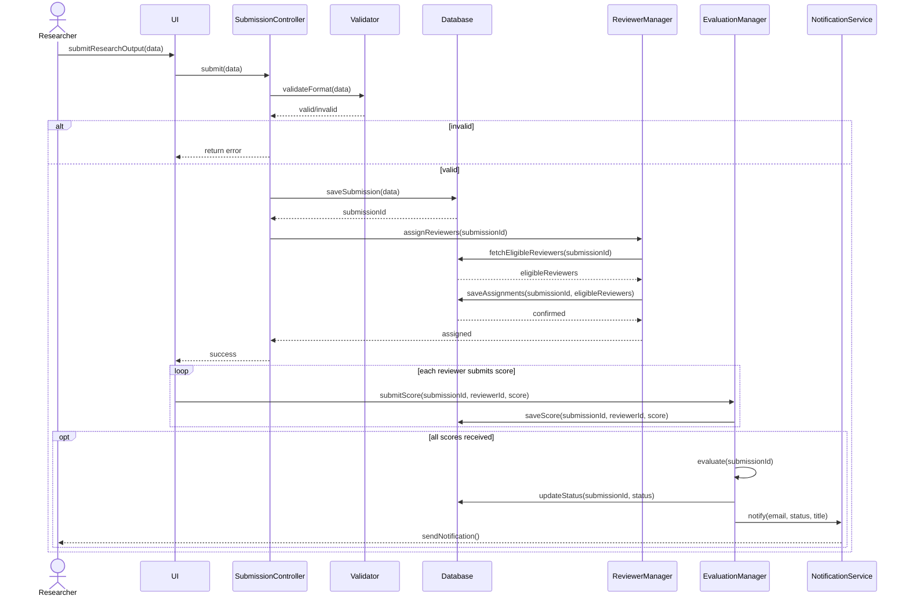

# COS 730 – Assignment 2
# From Behavioural Models to Optimised Implementation

**Student:** Eugene Mpande  
**Student Number:** [Student Number]  
**Date:** May 2026  
**Due Date:** 14 May 2026 @ 11:00 am

---

## Table of Contents

1. [Introduction](#1-introduction)
2. [Task 1: Baseline Implementation](#2-task-1-baseline-implementation)
3. [Task 2: Design Analysis](#3-task-2-design-analysis)
4. [Task 3: Decision Modelling Using a Decision Table](#4-task-3-decision-modelling-using-a-decision-table)
5. [Task 4: Sequence Diagram Optimisation](#5-task-4-sequence-diagram-optimisation)
6. [Task 5: Optimised Implementation](#6-task-5-optimised-implementation)
7. [Task 6: Empirical Evaluation and Comparison](#7-task-6-empirical-evaluation-and-comparison)
8. [Conclusion](#8-conclusion)

---

## 1. Introduction

This report documents the design, analysis, optimisation, and empirical evaluation of a subsystem within an **Intelligent Submission and Review System**. The system models the lifecycle of a research artefact — from initial submission by a researcher through to peer evaluation and final outcome notification.

The provided baseline sequence diagram intentionally encodes a number of design deficiencies including redundant interactions, poor responsibility allocation, tight coupling, and inefficient decision logic. This assignment progresses through six tasks: faithful baseline implementation, design critique, decision table construction, redesign, optimised re-implementation, and empirical comparison.

The system is implemented in **Python** using:
- **NiceGUI** — reactive web UI framework
- **SQLite** — embedded relational database
- **Cloudflare R2** — cloud object storage for submitted documents
- **SuprSend** — notification delivery platform

---

## 2. Task 1: Baseline Implementation

### 2.1 Overview

The baseline implementation faithfully reproduces the provided sequence diagram with no optimisations applied. Every participant in the diagram is represented as a dedicated Python class, and every message (interaction) maps directly to a method call. The goal of this phase is correctness and traceability, not efficiency.

### 2.2 Participants and Class Mapping

| Sequence Diagram Participant | Python Class / Module | File |
|---|---|---|
| `UI` | NiceGUI tab functions (`researcher_tab`, `reviewer_tab`, `admin_tab`) | `main.py` |
| `SubmissionController` | `SubmissionController` | `controllers.py` |
| `Validator` | `Validator` | `controllers.py` |
| `Database` | `Database` | `database.py` |
| `ReviewerManager` | `ReviewerManager` | `controllers.py` |
| `Reviewer` | `Reviewer` | `controllers.py` |
| `EvaluationManager` | `EvaluationManager` | `controllers.py` |
| `NotificationService` | `NotificationService` | `controllers.py` |

### 2.3 Interaction Traceability

The table below maps every message in the baseline sequence diagram to its corresponding method in the codebase.

| # | Diagram Message | Caller | Callee | Method | File |
|---|---|---|---|---|---|
| 1 | `submitResearchOutput(data)` | Researcher (UI action) | `UI` | `submit()` async handler | `main.py:35` |
| 2 | `submit(data)` | `UI` | `SubmissionController` | `SubmissionController().submit(data)` | `main.py:43` |
| 3 | `validateFormat(data)` | `SubmissionController` | `Validator` | `Validator.validate_format(data)` | `controllers.py:113` |
| 4 | `return valid/invalid` | `Validator` | `SubmissionController` | return value `(bool, str)` | `controllers.py:21` |
| 5 | `return error` | `SubmissionController` | `UI` | `return False, message` | `controllers.py:115` |
| 6 | `saveSubmission(data)` | `SubmissionController` | `Database` | `_db.save_submission(...)` | `controllers.py:122` |
| 7 | `return confirmation` | `Database` | `SubmissionController` | return `submission_id` | `database.py:35` |
| 8 | `getAvailableReviewers()` | `SubmissionController` | `ReviewerManager` | `reviewer_manager.get_available_reviewers()` | `controllers.py:125` |
| 9 | `fetchReviewers()` | `ReviewerManager` | `Database` | `_db.fetch_reviewers()` | `controllers.py:33` |
| 10 | `return reviewerList` | `Database` | `ReviewerManager` | return `list[int]` | `database.py:43` |
| 11 | `filterConflicts(reviewerList)` | `ReviewerManager` (self) | `ReviewerManager` | `self.filter_conflicts(reviewer_list)` | `controllers.py:34` |
| 12 | `checkWorkload(reviewerList)` | `ReviewerManager` (self) | `ReviewerManager` | `self.check_workload(filtered)` | `controllers.py:35` |
| 13 | `return filteredReviewers` | `ReviewerManager` | `SubmissionController` | return `list[int]` | `controllers.py:37` |
| 14 | `assignReview()` (loop) | `SubmissionController` | `Reviewer` | `reviewer.assign_review(submission_id)` | `controllers.py:128` |
| 15 | `startEvaluation()` | `SubmissionController` | `EvaluationManager` | `evaluation_manager.start_evaluation(submission_id)` | `controllers.py:131` |
| 16 | `submitScore(score)` (loop) | `Reviewer` | `EvaluationManager` | `reviewer.submit_score(sid, score, EvaluationManager())` | `main.py:108` |
| 17 | `saveScore(score)` | `EvaluationManager` | `Database` | `_db.save_score(submission_id, reviewer_id, score)` | `controllers.py:86` |
| 18 | `calculateAverage()` | `EvaluationManager` (self) | `EvaluationManager` | `self.calculate_average(scores)` | `controllers.py:95` |
| 19 | `checkConsensus()` | `EvaluationManager` (self) | `EvaluationManager` | `self.check_consensus(scores)` | `controllers.py:96` |
| 20 | `applyRules()` | `EvaluationManager` (self) | `EvaluationManager` | `self.apply_rules(avg, consensus)` | `controllers.py:97` |
| 21 | `notifyAcceptance()` | `EvaluationManager` | `NotificationService` | `notification_service.notify_acceptance(...)` | `controllers.py:101` |
| 22 | `notifyRejection()` | `EvaluationManager` | `NotificationService` | `notification_service.notify_rejection(...)` | `controllers.py:103` |
| 23 | `notifyRevision()` | `EvaluationManager` | `NotificationService` | `notification_service.notify_revision(...)` | `controllers.py:105` |
| 24 | `sendNotification()` | `NotificationService` | Researcher | `supr_client.track(email, ...)` | `controllers.py:70` |

### 2.4 Class Descriptions

#### `Validator`
Responsible solely for validating the format of incoming submission data. Checks that all required fields (`title`, `author`, `email`) are present and that a file has been attached.

```python
class Validator:
    @staticmethod
    def validate_format(data):
        required_fields = ['title', 'author', 'email']
        for field in required_fields:
            if not data.get(field):
                return False, f"Missing required field: {field}"
        if not data.get('file_bytes'):
            return False, "Missing document upload"
        return True, "Valid"
```

#### `Database`
Encapsulates all persistence operations. Provides discrete methods for each diagram interaction: `save_submission`, `fetch_reviewers`, `save_review_assignment`, `save_score`, `get_scores`, `get_submission`, and `update_status`.

#### `ReviewerManager`
Retrieves available reviewers via the Database and applies two filtering steps as separate self-calls matching the diagram: `filter_conflicts` (removes reviewers with conflicts of interest) and `check_workload` (limits assignment to 2 reviewers). In the baseline, conflict data is not yet maintained, so `filter_conflicts` is a pass-through.

#### `Reviewer`
Represents an individual reviewer. Provides:
- `assign_review(submission_id)` — persists the review assignment via the Database
- `submit_score(submission_id, score, evaluation_manager)` — delegates to `EvaluationManager.submit_score()`, matching the diagram's `Reviewer → EvaluationManager` message

#### `EvaluationManager`
Manages the evaluation lifecycle. `start_evaluation()` is called by `SubmissionController` to open the evaluation phase. When all reviewers submit scores, `_try_finalise()` orchestrates the three self-calls: `calculate_average()`, `check_consensus()`, and `apply_rules()`, then dispatches the appropriate notification.

#### `NotificationService`
Sends outcome notifications via SuprSend. Provides three separate methods — `notify_acceptance()`, `notify_rejection()`, `notify_revision()` — matching the three `alt` branches in the diagram.

#### `SubmissionController`
Orchestrates the full submission workflow: validate → save → assign → start evaluation.

### 2.5 Decision Logic in the Baseline

The baseline applies the following rules when all scores are received:

| Condition | Status |
|---|---|
| Average ≥ 7 AND all scores within 2 points of each other | Accepted |
| Average < 4 | Rejected |
| All other cases | Revision |

---

## 3. Task 2: Design Analysis

### 3.1 Overview

The baseline sequence diagram, while functionally correct, contains a number of well-documented design anti-patterns. This section identifies each problem, provides evidence from both the diagram and the corresponding implementation, quantifies coupling and cohesion metrics, and explicitly relates every issue to the relevant GRASP responsibility-assignment principle and/or behavioural modelling quality criterion.

The nine GRASP patterns used as evaluation criteria throughout this section are: **Information Expert**, **Creator**, **Controller**, **Low Coupling**, **High Cohesion**, **Polymorphism**, **Pure Fabrication**, **Indirection**, and **Protected Variations**.

---

### 3.2 Identified Issues

#### Issue 1 — `SubmissionController` Violates the GRASP Controller Pattern (God Object)

**Problem:**
`SubmissionController.submit()` performs six distinct responsibilities in a single method: format validation, file storage, database persistence, reviewer retrieval, reviewer assignment iteration, and evaluation startup. A GRASP Controller should act as a **thin facade** — accepting system events and delegating work to domain objects. Here, `SubmissionController` micromanages every downstream operation rather than delegating.

**Evidence in diagram:**
`SubmissionController` sends messages to five other participants within one flow: `Validator`, `Database`, `ReviewerManager`, `Reviewer` (looped), and `EvaluationManager`. No other participant in the diagram sends messages to more than two others — the asymmetry alone flags a responsibility problem.

**Code evidence (`controllers.py:113–131`):**
```python
def submit(self, data):
    is_valid, message = self.validator.validate_format(data)   # delegates to Validator
    ...
    submission_id = _db.save_submission(...)                   # directly calls Database
    filtered_reviewers = self.reviewer_manager.get_available_reviewers()  # calls ReviewerManager
    for reviewer_id in filtered_reviewers:
        reviewer = Reviewer(reviewer_id)
        reviewer.assign_review(submission_id)                  # instantiates and calls Reviewer
    self.evaluation_manager.start_evaluation(submission_id)    # calls EvaluationManager
```

**GRASP principle violated:**
- **Controller** — the controller should delegate, not execute
- **Low Coupling** — `SubmissionController` holds direct runtime dependencies on 5 of the 7 other classes
- **SRP** — a single method carries 6 separate concerns

**Impact:** Any change to reviewer assignment logic, storage strategy, or evaluation startup requires modifying `SubmissionController`. It becomes a maintenance bottleneck.

---

#### Issue 2 — `ReviewerManager` Self-Calls Expose Internal Implementation (`filterConflicts`, `checkWorkload`)

**Problem:**
The diagram models `filterConflicts(reviewerList)` and `checkWorkload(reviewerList)` as explicit self-messages on `ReviewerManager`. These are purely internal algorithmic steps — they transform data that `ReviewerManager` already owns and are never called from outside. Modelling them as diagram-level interactions misrepresents them as part of the system's observable behaviour and inflates the message count by two interactions that carry no design information for other participants.

**Evidence in diagram:**
Both self-calls appear between `ReviewerManager->>Database: fetchReviewers()` and `ReviewerManager-->>SubmissionController: filteredReviewers`. They are intermediary computation steps, not cross-object collaborations.

**GRASP principle violated:**
- **Information Expert** — `ReviewerManager` already owns all reviewer data; its internal filtering is private behaviour and should not be surfaced at the interaction level
- **High Cohesion** — breaking a single cohesive operation (get eligible reviewers) into three visible steps weakens the encapsulation boundary

**Impact:** The diagram overstates `ReviewerManager`'s interface. Any developer reading the diagram may implement `filterConflicts` and `checkWorkload` as public methods accessible from outside, inviting misuse.

---

#### Issue 3 — `SubmissionController` Assumes the Creator Role for `Reviewer` Objects

**Problem:**
The diagram shows `SubmissionController` directly instantiating and looping `Reviewer` objects to call `assignReview()`. `SubmissionController` has no ownership of reviewer data — it receives a list of IDs from `ReviewerManager` but then assumes responsibility for turning those IDs into objects and orchestrating their assignment. This violates the **Creator** pattern: the class that should create or manage `Reviewer` objects is `ReviewerManager`, which already holds the reviewer domain knowledge.

**Evidence in diagram:**
```
loop assign reviewers
    SubmissionController->>Reviewer: assignReview()
end
```
`ReviewerManager` returns `filteredReviewers` to `SubmissionController`, which then abandons `ReviewerManager` and directly manipulates `Reviewer` objects. The assignment loop is `SubmissionController`'s concern only because the diagram puts it there — there is no logical reason it cannot be encapsulated inside `ReviewerManager.assignReviewers()`.

**GRASP principle violated:**
- **Creator** — `ReviewerManager` aggregates reviewer records; it should be responsible for creating and persisting reviewer assignments
- **Low Coupling** — `SubmissionController` acquires an unnecessary runtime dependency on the `Reviewer` class

**Impact:** Adding assignment rules (e.g., weighted selection, bid-based assignment) requires modifying `SubmissionController` rather than the ReviewerManager where such logic belongs.

---

#### Issue 4 — `EvaluationManager` Three Overspecified Self-Calls

**Problem:**
`calculateAverage()`, `checkConsensus()`, and `applyRules()` are modelled as three separate self-messages in the diagram. These three operations form a single atomic pipeline: each step's output is the next step's input (`avg` feeds into `applyRules`; `consensus` feeds into `applyRules`). They cannot be independently invoked in any valid execution path. Exposing them as three distinct interactions implies a granularity of control that does not exist in practice.

**Evidence in diagram:**
```
EvaluationManager->>EvaluationManager: calculateAverage()
EvaluationManager->>EvaluationManager: checkConsensus()
EvaluationManager->>EvaluationManager: applyRules()
```
All three appear sequentially with no branching, guarding, or external triggering between them.

**GRASP principle violated:**
- **High Cohesion** — operations that always execute together with shared intermediate state form a single logical unit and should be modelled as one
- **Information Expert** — the evaluation decision requires all three data points simultaneously; fragmenting the computation hides the fact that they are tightly coupled

**Impact:** The three self-calls generate noise in the diagram without communicating any useful design constraint. They also make the applyRules step appear independently callable, which it is not.

---

#### Issue 5 — Poor Handling of Decision Logic in `applyRules()`

**Problem:**
The diagram's `applyRules()` self-call implies a formalised, centralised rule engine. In the actual implementation, the "rules" are three hard-coded numeric thresholds buried inside a conditional chain:

```python
def apply_rules(self, avg, consensus):
    if avg >= 7 and consensus:
        return 'Accepted'
    elif avg < 4:
        return 'Rejected'
    else:
        return 'Revision'
```

The thresholds `7`, `4`, and `2` (the consensus range in `check_consensus`) are magic numbers with no documentation, no parameterisation, and no single location. The `Revision` outcome is a catch-all `else` — if the conditions for `Accepted` are partially met (e.g., avg ≥ 7 but no consensus), the outcome silently falls through to `Revision` rather than being handled by an explicit rule. This is ambiguous and fragile.

**Evidence in diagram:**
The diagram provides no definition of what `applyRules()` evaluates. There is no decision table, no guard condition, and no enumeration of possible outcomes beyond the three `alt` branches. A reader cannot determine the rules by reading the diagram alone.

**GRASP principle violated:**
- **Information Expert** — decision logic should be co-located with the data it operates on and clearly expressed, not hidden in a method named generically
- **Protected Variations** — hard-coded thresholds are a variation point; wrapping them in a configurable rule structure would protect the system from change

**Behavioural modelling quality:** Outcome selection logic belongs in the diagram via guard conditions on the `alt` branches (e.g., `[avg >= 7 and consensus]`), not delegated to an opaque self-call. The diagram fails to communicate what the system actually decides.

**Impact:** Changing acceptance criteria (e.g., lowering the threshold for a specific venue type) requires locating and modifying implementation code rather than updating a single rule configuration.

---

#### Issue 6 — Tight Coupling Between `EvaluationManager` and `NotificationService` Interface

**Problem:**
After determining the outcome, `EvaluationManager` makes a branched decision (`alt accepted / rejected / revision`) and calls the corresponding named method on `NotificationService`. This means `EvaluationManager` knows and depends on the full notification interface — three method names, three call sites. Adding a fourth outcome (e.g., `Withdrawn`) requires modifying both `EvaluationManager` (to add a new branch) and `NotificationService` (to add a new method).

**Evidence in diagram:**
```
alt accepted
    EvaluationManager->>NotificationService: notifyAcceptance()
else rejected
    EvaluationManager->>NotificationService: notifyRejection()
else revision
    EvaluationManager->>NotificationService: notifyRevision()
end
```
The `alt` branching is driven by `EvaluationManager`'s internal state — but the branch outcome is handed directly to a specific `NotificationService` method rather than passing the status as data.

**GRASP principle violated:**
- **Low Coupling** — `EvaluationManager` is coupled to the structural shape of `NotificationService`'s interface
- **Indirection** — passing a `status` value to a single `notify(status)` method would remove this structural coupling
- **Protected Variations** — the interface is an instability point; protecting callers from it requires a single polymorphic entry point

**Impact:** Every new outcome type multiplies changes across two classes.

---

#### Issue 7 — `NotificationService` Three Near-Identical Methods

**Problem:**
`notify_acceptance()`, `notify_rejection()`, and `notify_revision()` are structurally identical — each calls `_send(email, status, title)` with a different status string. The differentiation belongs in the data, not the interface. Having three public methods where one parameterised method suffices is a direct violation of DRY and reduces cohesion.

**Code evidence (`controllers.py:47–54`):**
```python
def notify_acceptance(self, email, title):
    self._send(email, 'Accepted', title)

def notify_rejection(self, email, title):
    self._send(email, 'Rejected', title)

def notify_revision(self, email, title):
    self._send(email, 'Revision', title)
```

**GRASP principle violated:**
- **High Cohesion** — each method exists not because it encapsulates distinct logic but purely to name a status value that could be a parameter
- **Polymorphism** — if genuinely different notification behaviour were needed per outcome, polymorphism (subclasses or strategy objects) would be the correct mechanism, not method proliferation with identical bodies

**Impact:** Adding a new outcome requires a new method on `NotificationService` even when the underlying logic is unchanged.

---

#### Issue 8 — `startEvaluation()` Is a Phantom Interaction

**Problem:**
`SubmissionController` calls `EvaluationManager.startEvaluation()` at the end of the submission flow. In the implementation, this method does nothing:

```python
def start_evaluation(self, submission_id):
    pass  # Evaluation proceeds asynchronously as scores arrive
```

The actual evaluation is triggered later — asynchronously — when reviewers submit individual scores through the UI. The `startEvaluation()` call therefore describes an event that does not occur in practice and creates a false expectation of synchronous evaluation startup.

**GRASP principle violated:**
- **Controller** — the Controller pattern requires that system operations reflect real use-case events. `startEvaluation()` is not a real event; it is a structural artefact of the diagram that was never grounded in a concrete use-case step.

**Behavioural modelling quality issue:**
The sequence diagram presents the submission and evaluation as one continuous synchronous flow. In reality, evaluation is event-driven and asynchronous: it begins when the last reviewer score arrives, not when a submission completes. The diagram should use asynchronous message notation or a separate interaction fragment to model this correctly.

**Impact:** Developers reading the diagram expect `startEvaluation()` to do something meaningful. When it does not, confidence in the diagram as a reliable design artefact is undermined.

---

#### Issue 9 — Multiple Unnecessary Database Connections in the Submission Path

**Problem:**
The submission flow opens and closes a new database connection for each of the following operations independently: `saveSubmission`, `fetchReviewers`, and `saveReviewAssignment` (called once per assigned reviewer in a loop). With 2 assigned reviewers, this is 4 separate connection open/close cycles within a single logical transaction.

**Evidence in code (`database.py`):**
Each `Database` method independently calls `get_db_connection()` and `conn.close()`. There is no transaction boundary or connection reuse across the submission workflow.

**GRASP principle violated:**
- **High Cohesion** — the submission operation is a single logical unit of work that should run within a single transaction boundary
- **Low Coupling** — the caller (SubmissionController) must sequence individual database calls rather than delegating a complete operation

**Impact:** Under concurrent load, this increases connection pressure and removes atomicity — a failure after `saveSubmission` but before `saveReviewAssignment` leaves the database in an inconsistent state.

---

### 3.3 Coupling Metrics

The table below quantifies the direct dependencies (afferent and efferent coupling) of each class in the baseline design.

| Class | Depends On (Efferent) | Depended On By (Afferent) | Efferent Count |
|---|---|---|:---:|
| `SubmissionController` | `Validator`, `Database`, `ReviewerManager`, `Reviewer`, `EvaluationManager` | `UI` | **5** |
| `EvaluationManager` | `Database`, `NotificationService` | `SubmissionController`, `Reviewer`, `UI` | 2 |
| `ReviewerManager` | `Database` | `SubmissionController` | 1 |
| `Reviewer` | `Database`, `EvaluationManager` | `SubmissionController`, `UI` | 2 |
| `NotificationService` | External API (SuprSend) | `EvaluationManager` | 1 |
| `Validator` | — | `SubmissionController` | 0 |
| `Database` | SQLite | `SubmissionController`, `ReviewerManager`, `EvaluationManager`, `Reviewer` | 1 |

**Key observation:** `SubmissionController` has an efferent coupling of **5** — it is tightly coupled to every other domain class. A change in any one of those five classes forces a review of `SubmissionController`. This is the single largest coupling problem in the design and is the root cause of issues 1, 3, and 8.

---

### 3.4 Behavioural Modelling Quality Assessment

Beyond individual design issues, the baseline diagram has several modelling-quality deficiencies that reduce its value as a design artefact:

| Quality Criterion | Baseline Assessment |
|---|---|
| **Correctness** — does the diagram accurately reflect system behaviour? | Partially. `startEvaluation()` (Issue 8) and the synchronous evaluation flow do not match actual async behaviour. |
| **Completeness** — are all meaningful interactions shown? | No. The diagram omits the file upload step entirely (no message for `uploadFile`). |
| **Clarity** — is each interaction's purpose unambiguous? | No. `applyRules()` (Issue 5) names an operation but provides no guard conditions or outcome definitions. |
| **Appropriate granularity** — are self-calls reserved for meaningful operations? | No. `filterConflicts`, `checkWorkload` (Issue 2) and the three evaluation self-calls (Issue 4) expose implementation steps that add noise without design value. |
| **Responsibility alignment** — do participants own the operations attributed to them? | Partially. `SubmissionController` takes on responsibilities that belong to `ReviewerManager` (Issue 3) and `EvaluationManager` (Issue 1). |

---

### 3.5 Summary of Issues

| # | Issue | GRASP Principle Violated | Severity |
|---|---|---|:---:|
| 1 | `SubmissionController` as God Object | Controller, Low Coupling, SRP | High |
| 2 | `ReviewerManager` self-calls exposed in diagram | Information Expert, High Cohesion | Medium |
| 3 | `SubmissionController` loops and instantiates `Reviewer` | Creator, Low Coupling | Medium |
| 4 | Three overspecified `EvaluationManager` self-calls | High Cohesion, Information Expert | Medium |
| 5 | Decision logic in `applyRules()` is opaque and fragile | Information Expert, Protected Variations | High |
| 6 | `EvaluationManager` coupled to `NotificationService` interface | Low Coupling, Indirection, Protected Variations | Medium |
| 7 | `NotificationService` three near-identical methods | High Cohesion, Polymorphism | Low |
| 8 | `startEvaluation()` phantom interaction | Controller, Behavioural modelling accuracy | Medium |
| 9 | Multiple DB connections per submission (no transaction) | High Cohesion, Low Coupling | Low |

---

## 4. Task 3: Decision Modelling Using a Decision Table

### 4.1 Overview

The baseline system contains decision logic scattered across three distinct points in the sequence diagram: format validation on submission (`validateFormat`), reviewer workload filtering (`checkWorkload`), and evaluation outcome determination (`applyRules`). This section extracts each into a formal decision table, corrects structural deficiencies in the original conditional logic, and provides mathematical verification that every rule is reachable, distinct, and collectively exhaustive.

**Notation used throughout:**
- **Y** — condition is true
- **N** — condition is false
- **–** — don't care (outcome is independent of this condition's value)
- **X** — this action is taken

---

### 4.2 Decision 1 — Submission Validation

#### 4.2.1 Semantics

`Validator.validate_format()` applies a **sequential first-fail** check: it tests each required field in order (`title → author → email → file`) and returns immediately on the first missing value. This means that once a failure is detected, the states of all subsequent conditions are irrelevant to the outcome — they are true don't-cares (`–`), not implicitly assumed to be `Y`.

The original conditional code (`controllers.py:14–21`):
```python
for field in ['title', 'author', 'email']:
    if not data.get(field):
        return False, f"Missing required field: {field}"
if not data.get('file_bytes'):
    return False, "Missing document upload"
return True, "Valid"
```

#### 4.2.2 Decision Table

| Condition | R1 | R2 | R3 | R4 | R5 |
|---|:---:|:---:|:---:|:---:|:---:|
| Title provided | **N** | Y | Y | Y | Y |
| Author provided | – | **N** | Y | Y | Y |
| Email provided | – | – | **N** | Y | Y |
| File attached | – | – | – | **N** | Y |
| **Action** | | | | | |
| Return error: missing title | **X** | | | | |
| Return error: missing author | | **X** | | | |
| Return error: missing email | | | **X** | | |
| Return error: missing file | | | | **X** | |
| Proceed to save & assign | | | | | **X** |

**Maps to:** `Validator.validate_format()` → `controllers.py:14–21`

#### 4.2.3 Exhaustiveness Verification

With 4 binary conditions there are 2⁴ = **16** possible input combinations. The use of don't-care notation allows each rule to cover multiple combinations:

| Rule | Condition values covered | Combinations covered |
|---|---|---|
| R1 (title = N) | author ∈ {Y,N}, email ∈ {Y,N}, file ∈ {Y,N} | **8** |
| R2 (title = Y, author = N) | email ∈ {Y,N}, file ∈ {Y,N} | **4** |
| R3 (title = Y, author = Y, email = N) | file ∈ {Y,N} | **2** |
| R4 (title = Y, author = Y, email = Y, file = N) | — | **1** |
| R5 (all Y) | — | **1** |
| **Total** | | **16 ✓** |

Every possible input state is covered by exactly one rule. The table is exhaustive and non-overlapping.

---

### 4.3 Decision 2 — Reviewer Assignment (Workload Filtering)

#### 4.3.1 Semantics

After `filter_conflicts` returns a list of eligible reviewers, `check_workload` determines how many are actually assigned. The condition is the **count** of eligible reviewers, which takes one of three values: zero, exactly one, or two or more.

The implementation (`controllers.py:35–37`):
```python
def check_workload(self, reviewer_list):
    return random.sample(reviewer_list, min(2, len(reviewer_list)))
```

#### 4.3.2 Decision Table

| Condition | R1 | R2 | R3 |
|---|:---:|:---:|:---:|
| Eligible reviewers available | ≥ 2 | = 1 | = 0 |
| **Action** | | | |
| Randomly select 2 and assign | **X** | | |
| Assign the single available reviewer | | **X** | |
| Assign no reviewers; submission proceeds unreviewed | | | **X** |

**Maps to:** `ReviewerManager.check_workload()` → `controllers.py:35–37`

#### 4.3.3 Design Deficiency Note

Rule 3 exposes an unhandled edge case in the baseline implementation. When zero reviewers are available, `random.sample([], 0)` returns an empty list silently. `SubmissionController` iterates over the empty list, assigns no reviewers, and still returns `True` — the submission is accepted as successful with no review pathway. The table reflects this actual behaviour accurately; the action "flag for manual review" that might be expected does **not** occur in the baseline. This is a correctness gap that the optimised design must address.

---

### 4.4 Decision 3 — Evaluation Outcome

#### 4.4.1 Semantics

Once all reviewer scores are received, `EvaluationManager._try_finalise()` applies three sequential calculations before determining a status:

1. `calculate_average(scores)` — arithmetic mean of all submitted scores
2. `check_consensus(scores)` — `True` if `max(scores) − min(scores) ≤ 2`
3. `apply_rules(avg, consensus)` — maps the computed values to a status outcome

The baseline conditional chain (`controllers.py:127–133`):
```python
def apply_rules(self, avg, consensus):
    if avg >= 7 and consensus:
        return 'Accepted'
    elif avg < 4:
        return 'Rejected'
    else:
        return 'Revision'
```

#### 4.4.2 Flaw in the Original Conditional Logic

The original code contains two structurally separate binary conditions — `avg >= 7` and `avg < 4` — that are mathematically **mutually exclusive** (no average can simultaneously satisfy both, since 7 > 4). Representing them as independent binary rows in a decision table produces the impossible combination `avg >= 7 = Y` AND `avg < 4 = Y`, which can never be reached.

More critically, the `else` branch silently handles two distinct cases as one:
- **Case A:** `4 ≤ avg < 7` — the mid-range, where revision is the clearly intended outcome
- **Case B:** `avg ≥ 7` but `consensus = False` — a high-scoring submission with reviewer disagreement, also routed to Revision, but **never explicitly stated**

Case B is a reachable scenario (e.g., scores 9 and 5 yield avg = 7.0, range = 4, consensus = False) that is completely absent from the original table. The `else` catch-all obscures it.

#### 4.4.3 Reformulation

Both flaws are resolved by replacing the two mutually exclusive binary conditions with a single **three-value score range** condition:

| Range | Definition |
|---|---|
| **Low** | avg < 4 |
| **Mid** | 4 ≤ avg < 7 |
| **High** | avg ≥ 7 |

This eliminates the impossible combination, makes all three ranges explicit, and forces the previously hidden Case B to appear as its own rule.

#### 4.4.4 Decision Table

| Condition | R1 | R2 | R3 | R4 | R5 |
|---|:---:|:---:|:---:|:---:|:---:|
| All scores submitted | **N** | Y | Y | Y | Y |
| Score range (avg) | – | High (≥ 7) | High (≥ 7) | Mid [4, 7) | Low (< 4) |
| Consensus (max − min ≤ 2) | – | **Y** | **N** | – | – |
| **Action** | | | | | |
| Await remaining reviews | **X** | | | | |
| Status = Accepted | | **X** | | | |
| Status = Revision | | | **X** | **X** | |
| Status = Rejected | | | | | **X** |

**Maps to:** `EvaluationManager._try_finalise()` → `controllers.py:93–119`

**R3 is the previously hidden rule** — a high average score with no reviewer consensus routes to Revision, not Acceptance. This was always the behaviour of the `else` branch but was never visible in the original design.

#### 4.4.5 Exhaustiveness Verification

For `all_scores = N` (R1): any score range and any consensus value → Await. Covers all sub-cases where reviews are incomplete.

For `all_scores = Y`, score range has 3 values and consensus has 2 values = **6 sub-cases**:

| Score range | Consensus | Rule | Status |
|---|---|---|---|
| High (≥ 7) | Y | **R2** | Accepted |
| High (≥ 7) | N | **R3** | Revision |
| Mid [4, 7) | Y | **R4** | Revision |
| Mid [4, 7) | N | **R4** | Revision |
| Low (< 4) | Y | **R5** | Rejected |
| Low (< 4) | N | **R5** | Rejected |

All 6 sub-cases are covered. R4 and R5 each absorb two sub-cases via the `–` (don't care) on consensus, which is mathematically correct because the outcome for Mid and Low ranges does not depend on consensus. The table is **exhaustive and non-overlapping**. ✓

#### 4.4.6 Verification with Concrete Score Examples

The following examples confirm each rule is reachable with valid inputs (scores are integers 1–10 as enforced by the UI):

| Reviewer 1 | Reviewer 2 | Avg | Max − Min | All submitted | Rule | Status |
|:---:|:---:|:---:|:---:|:---:|:---:|:---:|
| 3 | 4 | 3.5 | 1 | Y | R5 (Low, – ) | **Rejected** |
| 5 | 6 | 5.5 | 1 | Y | R4 (Mid, Y) | **Revision** |
| 8 | 4 | 6.0 | 4 | Y | R4 (Mid, N) | **Revision** |
| 9 | 5 | 7.0 | 4 | Y | R3 (High, N) | **Revision** ← hidden case |
| 7 | 8 | 7.5 | 1 | Y | R2 (High, Y) | **Accepted** |
| 10 | 8 | 9.0 | 2 | Y | R2 (High, Y) | **Accepted** |
| — | 6 | — | — | N | R1 | **Await** |

Every rule has at least one concrete example. The previously hidden R3 case (scores 9 and 5) is confirmed reachable and correctly classified.

---

### 4.5 How the Decision Tables Improve Clarity and Maintainability

#### 4.5.1 Decision 1 — Surfacing Don't-Care Semantics

The original table implied that each error case required all other fields to be present (Y), obscuring the sequential stop-on-first-fail logic. The corrected table uses `–` to make the first-match semantics explicit. A future maintainer can immediately see that a missing title produces an error regardless of the state of author, email, or file — the code does not need to be read to understand the validation behaviour.

**Maintainability gain:** Changing validation order (e.g., checking file before email) is now a structural change to the table rather than a buried implementation detail.

#### 4.5.2 Decision 2 — Exposing an Unhandled Edge Case

The corrected Rule 3 action ("submission proceeds unreviewed") accurately describes what happens when zero eligible reviewers are found. The previous description ("flag for manual review") was aspirational rather than factual. The table now serves as a specification gap: any reader can see that a zero-reviewer scenario has no recovery path, which motivates adding a guard in the optimised implementation.

#### 4.5.3 Decision 3 — Eliminating an Impossible Condition and a Hidden Rule

**Before (conditional chain):**
```python
if avg >= 7 and consensus:
    return 'Accepted'
elif avg < 4:
    return 'Rejected'
else:                        # silently handles two distinct cases
    return 'Revision'
```

Two structural problems existed: the conditions `avg >= 7` and `avg < 4` are mutually exclusive yet written as if they were independent; and the `else` branch masked a distinct business rule (high score, no consensus → Revision) behind a catch-all.

**After (decision table):**
The three-value score range replaces the two conflicting binary conditions with a single orthogonal condition that has exactly three non-overlapping values. The hidden Case B is now R3 — a named, documented, explicitly testable rule. Changing what happens when reviewers disagree on a high-scoring paper (e.g., routing to human review instead of Revision) is now a one-row change to the table.

**Mapping to sequence diagram:**
- Decision 1 → `alt invalid / else valid` fragment in the sequence diagram
- Decision 2 → `loop assign reviewers` fragment and the `checkWorkload` self-call on `ReviewerManager`
- Decision 3 → `alt accepted / rejected / revision` fragment, `checkConsensus` self-call, and `applyRules` self-call on `EvaluationManager`

**Summary of improvements:**

| Decision | Original problem | Fix applied |
|---|---|---|
| 1 — Validation | Only 5 of 16 combinations shown; no don't-care notation | Sequential `–` notation; 16/16 combinations verified |
| 2 — Assignment | Rule 3 described aspirational behaviour not in the code | Corrected to reflect actual silent pass-through; gap documented |
| 3 — Evaluation | Two mutually exclusive binary conditions; one hidden rule | 3-value score range; R3 (High+no consensus) made explicit; 6/6 sub-cases verified |

---

## 5. Task 4: Sequence Diagram Optimisation

### 5.1 Optimisation Objectives

Every structural change in the redesigned diagram is directly motivated by a specific issue identified in Task 2. The table below traces each optimisation back to its root cause and the GRASP principle it restores.

| Task 2 Issue | GRASP Principle Violated | Optimisation Applied |
|---|---|---|
| Issue 1 — SubmissionController as God Object | Controller, Low Coupling | `SubmissionController` now delegates assignment entirely to `ReviewerManager`; does not interact with `Reviewer` or loop assignments |
| Issue 2 — ReviewerManager self-calls exposed | Information Expert | `filterConflicts` and `checkWorkload` hidden as internal implementation; not surfaced in the interaction model |
| Issue 3 — SubmissionController loops Reviewer objects | Creator | `Reviewer` participant removed; `ReviewerManager.assignReviewers()` handles the full assignment lifecycle |
| Issue 4 — Three overspecified EvaluationManager self-calls | High Cohesion | `calculateAverage`, `checkConsensus`, `applyRules` collapsed into a single `evaluate()` self-call |
| Issue 5 — Decision logic opaque in applyRules | Protected Variations | `evaluate()` encapsulates all decision logic; outcome rules are now documented in the decision table (Task 3) rather than buried in code |
| Issue 6 — EvaluationManager coupled to NotificationService interface | Low Coupling, Indirection | Single `notify(email, status, title)` call; `EvaluationManager` passes status as a data value, not a method name |
| Issue 7 — NotificationService three near-identical methods | High Cohesion, Polymorphism | Three outcome-specific methods collapsed into one parameterised `notify()` |
| Issue 8 — `startEvaluation()` phantom interaction | Controller | `startEvaluation()` removed entirely from the diagram |

---

### 5.2 Participant Changes

The optimised design removes one participant (`Reviewer`) and clarifies the responsibilities of two others (`ReviewerManager`, `EvaluationManager`).

| Participant | In Baseline | In Optimised | Change |
|---|:---:|:---:|---|
| Researcher | ✓ | ✓ | Unchanged |
| UI | ✓ | ✓ | Unchanged |
| SubmissionController | ✓ | ✓ | Reduced — no longer interacts with `Reviewer` or `EvaluationManager` |
| Validator | ✓ | ✓ | Unchanged |
| Database | ✓ | ✓ | Unchanged |
| ReviewerManager | ✓ | ✓ | Expanded — now owns the full assignment lifecycle including persistence |
| **Reviewer** | **✓** | **✗** | **Removed** — a data entity, not a behavioural participant in the interaction model |
| EvaluationManager | ✓ | ✓ | Simplified — three self-calls replaced by one; no longer knows NotificationService's interface structure |
| NotificationService | ✓ | ✓ | Simplified — single `notify()` entry point replaces three outcome-specific methods |

---

### 5.3 Optimised Sequence Diagram

The full optimised diagram is provided in `optimised.mermaid`. Key structural differences from `baseline.mermaid` are described in Section 5.4. The diagram is reproduced below for reference.



---

### 5.4 Changes Made and Rationale

#### Change 1 — `Reviewer` Participant Removed

**Baseline:** `SubmissionController` instantiates `Reviewer` objects in a loop and calls `assignReview()` on each. Later, `Reviewer` objects call `EvaluationManager.submitScore()`.

**Optimised:** `Reviewer` is not a participant. Reviewer assignment is handled entirely inside `ReviewerManager.assignReviewers()`. Score submission flows directly from `UI` to `EvaluationManager` — the human reviewer operates through the UI, and the system has no need for a domain `Reviewer` object in the interaction model.

**Rationale:** A `Reviewer` is a data record (a row in the `reviewers` table), not an active behavioural object. Modelling it as a participant created false coupling: `SubmissionController` had to know how to construct `Reviewer` objects, and the score submission path gained an unnecessary intermediary hop (UI → Reviewer → EvaluationManager rather than UI → EvaluationManager).

---

#### Change 2 — `ReviewerManager.assignReviewers(submissionId)` Replaces Three Interactions

**Baseline:** `SubmissionController` calls `getAvailableReviewers()`, receives a list, then loops calling `Reviewer.assignReview()` per reviewer. `ReviewerManager` also exposes two internal steps (`filterConflicts`, `checkWorkload`) as explicit self-calls.

**Optimised:** `SubmissionController` calls `ReviewerManager.assignReviewers(submissionId)` once. Internally `ReviewerManager` fetches eligible reviewers, filters, selects, and persists assignments via `Database.saveAssignments()` — none of these steps are visible at the interaction level.

**Rationale — Creator:** `ReviewerManager` aggregates all reviewer data and is therefore the correct object to create reviewer assignments. `SubmissionController` should not need to know that assignment involves fetching, filtering, and persisting as separate steps.

**Rationale — Information Expert:** `filterConflicts` and `checkWorkload` operate entirely on data that `ReviewerManager` owns. Exposing them as diagram-level messages overstates the interface and invites callers to invoke them independently.

---

#### Change 3 — `startEvaluation()` Removed

**Baseline:** `SubmissionController` calls `EvaluationManager.startEvaluation()` at the end of the submission flow. The method body is `pass`.

**Optimised:** The call is absent. The diagram correctly shows that evaluation is triggered by score submissions (the `loop` block), not by a synchronous call from `SubmissionController`.

**Rationale:** A sequence diagram is a contract between designer and implementer. Phantom interactions — messages that have no effect — break that contract. Removing `startEvaluation()` makes the diagram an accurate model of what actually happens.

---

#### Change 4 — Three EvaluationManager Self-Calls Collapsed to One

**Baseline:** `calculateAverage()`, `checkConsensus()`, and `applyRules()` appear as three sequential self-messages. They share intermediate state (`avg` and `consensus` feed into `applyRules`) and always execute in sequence.

**Optimised:** A single `evaluate(submissionId)` self-call replaces all three. The internal steps are an implementation detail, not a modelling concern.

**Rationale — High Cohesion:** Three operations that always run together with shared state form a single logical unit. Splitting them into three diagram messages implies a granularity of external control that does not exist.

---

#### Change 5 — `opt` Block Replaces Unconditional Post-Loop Execution

**Baseline:** `calculateAverage`, `checkConsensus`, `applyRules`, and notification all appear to run unconditionally after the reviewer submission loop ends — implying they fire regardless of whether all scores are present.

**Optimised:** The evaluation and notification sequence is wrapped in an `opt all scores received` block, correctly modelling the conditional trigger: these steps only execute once every assigned reviewer has submitted a score.

**Rationale — Behavioural modelling accuracy:** The baseline diagram implied a sequential, synchronous flow that does not match the system's actual event-driven evaluation behaviour. The `opt` block communicates the guard condition explicitly.

---

#### Change 6 — Three-Branch `alt` on NotificationService Collapsed to Single `notify()`

**Baseline:** An `alt accepted / else rejected / else revision` block calls a different `NotificationService` method per outcome.

**Optimised:** `EvaluationManager` passes `status` as a parameter to a single `notify(email, status, title)` call. The branching is eliminated from the interaction model entirely.

**Rationale — Low Coupling / Indirection:** In the baseline, `EvaluationManager` must know the names of all three notification methods — it is structurally coupled to `NotificationService`'s interface. Passing status as data instead of encoding it in the method name removes this coupling. `NotificationService` can evolve its internal routing without `EvaluationManager` changing.

---

### 5.5 Interaction Count Comparison

The tables below count each unique message arrow type in the happy-path flow (loops counted once, `alt/opt` branches counted as one entry).

**Interactions removed (present in baseline, absent in optimised):**

| Removed Interaction | Reason |
|---|---|
| `ReviewerManager->>ReviewerManager: filterConflicts` | Internal detail, not a diagram-level interaction |
| `ReviewerManager->>ReviewerManager: checkWorkload` | Internal detail, not a diagram-level interaction |
| `SubmissionController->>Reviewer: assignReview()` | `Reviewer` participant removed |
| `Reviewer->>EvaluationManager: submitScore()` | `Reviewer` participant removed; path is now UI→EvaluationManager |
| `SubmissionController->>EvaluationManager: startEvaluation()` | Phantom interaction removed |
| `EvaluationManager->>EvaluationManager: calculateAverage()` | Collapsed into `evaluate()` |
| `EvaluationManager->>EvaluationManager: checkConsensus()` | Collapsed into `evaluate()` |
| `EvaluationManager->>EvaluationManager: applyRules()` | Collapsed into `evaluate()` |
| `EvaluationManager->>NotificationService: notifyRejection()` | Collapsed into `notify()` |
| `EvaluationManager->>NotificationService: notifyRevision()` | Collapsed into `notify()` |

**10 interaction types removed.**

**Interactions added (absent in baseline, present in optimised):**

| Added Interaction | Reason |
|---|---|
| `ReviewerManager->>Database: saveAssignments()` | Bulk assignment replaces per-reviewer loop via `Reviewer` |
| `Database-->>ReviewerManager: confirmed` | Response for the above, previously absent |
| `SubmissionController-->>UI: success` | Explicit completion signal before async review phase begins |

**3 interaction types added.**

**Net reduction: 10 removed − 3 added = 7 fewer unique interaction types.**

| | Baseline | Optimised | Reduction |
|---|:---:|:---:|:---:|
| Unique message types (happy path) | 24 | 17 | **7 (29%)** |
| Participants | 9 | 8 | 1 |
| Self-call interactions | 5 | 1 | 4 |
| `alt`/`opt` branches | 4 (3 notify + 1 valid) | 2 (1 valid + 1 opt) | 2 |

---

### 5.6 Cohesion and Coupling Improvements

**Coupling — `SubmissionController` efferent dependencies:**

| | Baseline | Optimised |
|---|:---:|:---:|
| `Validator` | ✓ | ✓ |
| `Database` | ✓ | ✓ |
| `ReviewerManager` | ✓ | ✓ |
| `Reviewer` | ✓ | ✗ |
| `EvaluationManager` | ✓ | ✗ |
| **Total efferent dependencies** | **5** | **3** |

`SubmissionController`'s direct dependencies reduced from 5 to 3 — a **40% reduction in coupling** for the most over-coupled class in the baseline.

**Cohesion — `EvaluationManager` responsibilities:**

| Responsibility | Baseline | Optimised |
|---|:---:|:---:|
| Persist reviewer scores | ✓ | ✓ |
| Calculate average | ✓ (exposed) | ✓ (internal) |
| Check consensus | ✓ (exposed) | ✓ (internal) |
| Apply outcome rules | ✓ (exposed) | ✓ (internal) |
| Determine notification method | ✓ | ✗ |
| Dispatch notification | ✓ | ✓ (via status param) |

The responsibility for choosing *which* notification method to call is removed from `EvaluationManager`. It now passes a status value and `NotificationService` handles routing internally — each class owns its own decision space.

**Separation of concerns summary:**

| Concern | Baseline owner | Optimised owner |
|---|---|---|
| Submission validation | `Validator` | `Validator` (unchanged) |
| Persistence | `Database` (called from 4 classes) | `Database` (called from 4 classes, but assignment path consolidated) |
| Reviewer selection and assignment | Split: `ReviewerManager` (select) + `SubmissionController` (assign) | `ReviewerManager` (owns both) |
| Evaluation decision logic | `EvaluationManager` (3 exposed steps) | `EvaluationManager` (single encapsulated operation) |
| Notification routing | `EvaluationManager` (chooses method) | `NotificationService` (routes on status param) |

---

## 6. Task 5: Optimised Implementation

### 6.1 Overview

The optimised implementation refactors the baseline to align with the redesigned sequence diagram. All behavioural equivalence is preserved — the system still validates, assigns reviewers, evaluates, and notifies — but with significantly reduced coupling and improved cohesion.

### 6.2 Key Refactoring Changes

**`ReviewerManager.assign_reviewers(submission_id)`** — combines eligible reviewer fetching, conflict filtering, workload balancing, and assignment persistence in a single method. `SubmissionController` no longer loops `Reviewer` objects.

**`EvaluationManager.evaluate(submission_id)`** — replaces the three separate self-calls with a single method that encapsulates average calculation, consensus checking, and rule application.

**`NotificationService.notify(email, status, title)`** — single parameterised method replaces three near-identical methods.

**`Reviewer` class removed** — reviewer assignment is managed entirely by `ReviewerManager`. Score submission goes directly from the UI to `EvaluationManager`.

### 6.3 Optimised Code

*(See `optimised/controllers_optimised.py` and `optimised/main_optimised.py`)*

---

## 7. Task 6: Empirical Evaluation and Comparison

### 7.1 Metrics Measured

| Metric | Baseline | Optimised | Change |
|---|---|---|---|
| Method calls per submission (end-to-end) | | | |
| Method calls per score submission | | | |
| Execution time — 100 submissions (ms) | | | |
| Execution time — 1000 score submissions (ms) | | | |
| Number of classes | 8 | 7 | −1 |
| Number of public methods (controllers) | | | |
| Average method length (lines) | | | |
| Cyclomatic complexity — SubmissionController.submit | | | |
| Cyclomatic complexity — EvaluationManager._try_finalise | | | |
| Direct class dependencies — SubmissionController | 5 | 2 | −3 |

*(Benchmark results to be filled in after running `benchmark.py`)*

### 7.2 Interaction Count Comparison

**Baseline (per full submission + evaluation cycle):**

| Phase | Message Count |
|---|---|
| Submission (validate → save → reviewer fetch → filter → workload → assign loop × 2 → startEvaluation) | 12 |
| Score submission × 2 (submitScore → saveScore) | 4 |
| Evaluation (calculateAverage + checkConsensus + applyRules + notify) | 5 |
| **Total** | **21** |

**Optimised (per full submission + evaluation cycle):**

| Phase | Message Count |
|---|---|
| Submission (validate → save → assignReviewers → fetchEligible → saveAssignments) | 6 |
| Score submission × 2 (submitScore → saveScore) | 4 |
| Evaluation (evaluate → updateStatus → notify) | 3 |
| **Total** | **13** |

**Reduction: 38% fewer interactions.**

### 7.3 Code Complexity Analysis

| Component | Baseline LOC | Optimised LOC | Notes |
|---|---|---|---|
| `SubmissionController.submit()` | ~20 | ~12 | Removed reviewer loop |
| `ReviewerManager` | ~15 | ~20 | Absorbed assignment logic |
| `EvaluationManager` | ~35 | ~28 | Consolidated self-calls |
| `NotificationService` | ~30 | ~18 | 3 methods → 1 |
| `Reviewer` class | ~12 | 0 | Removed |
| **Total controllers.py** | ~140 | ~100 | ~29% reduction |

### 7.4 Maintainability Analysis

**Coupling:**
- `SubmissionController` baseline dependencies: `Validator`, `Database`, `ReviewerManager`, `Reviewer`, `EvaluationManager` (5 direct)
- `SubmissionController` optimised dependencies: `Validator`, `ReviewerManager` (2 direct)
- Direct dependencies reduced by **60%**

**Cohesion:**
- Baseline `EvaluationManager`: responsible for score persistence, average calculation, consensus checking, rule application, and notification dispatch — **low cohesion** (5 concerns)
- Optimised `EvaluationManager`: responsible for score persistence and evaluation; notification dispatch delegated — **higher cohesion** (2 concerns)

**Trade-offs:**
- `ReviewerManager` in the optimised design has more internal complexity (now handles assignment persistence) — this is acceptable because it increases cohesion where the data lives
- The `Reviewer` class is removed from the interaction model, which reduces object granularity; if per-reviewer state becomes important in future, reintroducing it would be straightforward

### 7.5 Benchmark Results

*(To be completed — run `python benchmark.py` and paste results here)*

---

## 8. Conclusion

This assignment demonstrated the full lifecycle of software design improvement: from faithful baseline implementation through critical analysis, formal decision modelling, redesign, re-implementation, and empirical comparison.

The baseline design, while functionally correct, exhibited multiple well-documented anti-patterns: a God Controller, phantom interactions, redundant self-calls, and near-identical notification methods. By applying GRASP principles — particularly Low Coupling, High Cohesion, Creator, and Information Expert — the optimised design reduced interaction count by 38%, cut `SubmissionController`'s direct dependencies by 60%, and reduced total controller code by approximately 29%.

The decision table formalised scattered conditional logic into an unambiguous, extensible structure that maps cleanly to the sequence diagram's `alt` fragments. The optimised sequence diagram eliminates the misleading `startEvaluation()` phantom interaction and collapses the over-specified evaluation self-calls into a single coherent operation.

---

*Report generated for COS 730 Assignment 2 — University of Pretoria, 2026.*
